### [ps6破解](https://www.jianshu.com/p/097353202b66)
---


#### 抠图常用方法 
---
````

 方法一：
    1、建立选区
    2、Ctrl+J将选区自动复制到图层
    3，将图层导出为PNG（右下面图层导入为PNG）
````

#### 文件新建:ctrl+n 
---


````
若有经常使用的尺寸，可以直接设置好宽度和高度，点击存储预设；
注：ctrl+alt+n  重复上次的文件尺寸大小；
若不需要此尺寸，可以直接选中并点击删除预设；

分辨率:
	若用于网页设计，网页浏览，可选择72分辨率，单位为像素
	若用于高级图像处理，可选择300分辨率，单位为像素
	若用于印刷等出版，可选择300分辨率，单位可以选择毫米或厘米
颜色模式:RGB模式、CMYK模式、位图、灰度、Lab颜色
    RGB模式：RGB模式是PS中最常用的模式，也被称之为真彩色模式，在RGB模式下显示的图像质量较高，也是PS的默认模式；RGB颜色模式主要是由R（红）、G（绿）、B（蓝）三种基本色相加进行配色，并组成了红绿蓝三种颜色通道；该模式适用于显示器、投影仪、扫描仪、数码相机等；
    CMYK模式：CMYK颜色模式是打印全彩图像的颜色系统。青色、品红、黄色、和黑色是平版印刷机和喷墨打印机使用的油墨颜色。CMYK模式主要是由C（青）、M（洋红）、Y（黄）、K（黑）4种颜色相减而配色的。因此它也组成了青、洋红、黄、黑4个通道，每个通道混合而构成了多种色彩。
  当对图像进行印刷时，必须将它的颜色模式转换为CMYK模式。由于在CMYK模式下Photoshop的许多滤镜效果无法使用，所以一般都使用RGB模式，只有在即将进行印刷时才转换成CMYK模式，这时的颜色可能会发生改变。
   位图：位图模式是用黑色和白色来表现图像的，不包含灰度和其他颜色，因此它也被称为黑白图像。
   灰度：灰度模式下的图像只有灰度，而没有其他颜色。如果将彩色图像转换成灰度模式后，所有的颜色将被不同的灰度所代替。
   Lab颜色：Lab模式既不依赖光线,也不依赖于颜料,Lab模式由三个通道组成,它的一个通道是亮度,即L.另外两个是色彩通道,用A和B来表示.A通道包括的颜色是从深绿色（底亮度值）到灰色（中亮度值）再到亮粉红色（高亮度值）；B通道则是从亮蓝色（底亮度值）到灰色（中亮度值）再到黄色（高亮度值）.因此,这种色彩混合后将产生明亮的色彩.


背景内容：
   白色：背景画布为白色单色
   背景色：背景画布的颜色为背景色设置的颜色
   透明：背景内容无颜色填充，呈现透明状态   
````

-----

##### 文件的存储


````
常用的格式：
   PSD格式是Photoshop工具的默认格式，也是唯一支持所有图像模式的文件格式。它可以保存图像中的图层、通道、辅助线和路径等信息。一般寻找素材会选择PSD格式，文件做完或者没做完都习惯性保存PSD源文件，方便后期修改。由于PSD格式所包含的图像数据信息比较多，因此比其他格式的图像文件要大得多。
   JPEG是一种有损压缩的格式，此格式的图像通常用于图像预览和一些超文本的文档中（HTML文档），文件后辍名为“.jpg”或“.jpeg”，最大的特色是文件比较小，可以进行高倍率的压缩，是目前所有格式中压缩率比较高的格式之一，但是JPEG格式在压缩保存的过程中会以失量最小的方式丢掉一些肉眼不易察觉的数据，因而保存的图像与原图有所差别，没有原图的质量好，不适合印刷使用。
   PNG用来存储灰度图像时，灰度图像的深度可多到16位：存储彩色图像时，彩色图像的深度可多到48位，并且还可存储多到16位的通道数据。PNG在网页应用中使用较为广泛,比如在Dreamweaver中插入一张透明背景图片，就可以使用PNG格式的图片。PNG能保留完整的照片色彩，是一种非失真性压缩格式。不过唯一的缺点是文件较大，不利于网页浏览。由于PNG格式不完全支持所有浏览器，所以在网页使用要比GIF和JPEG格式使用少的多。
   GIF格式是一种图形格式，只是保存最多256色的RGB色阶数，是一种基于LZW算法的连续色调的无损压缩格式。目前几乎所有相关软件都支持它。GIF格式的另一个特点是其在一个GIF文件中可以存多幅彩色图像，如果把存于一个文件中的多幅图像数据逐幅读出并显示到屏幕上，就可构成一种最简单的动画。GIF分为静态GIF和动画GIF两种，扩展名为.gif，是一种压缩位图格式，支持透明背景图像，适用于多种操作系统，“体型”很小，网上很多小动画都是GIF格式。其实GIF是将多幅图像保存为一个图像文件，从而形成动画，所以归根到底GIF仍然是图片文件格式。
   BMP格式：它是Window操作系统中的标准图像文件格式，其不支持CMYK模式的图像。由于BMP文件格式是Windows环境中交换与图有关的数据的一种标准，因此在Windows环境中运行的图形图像软件都支持BMP图像格式。
   TIFF格式：TIFF是一种无损压缩格式，是一种非常广泛的图像格式，TIFF与JPEG和PNG一起成为流行的高位彩色图像格式。TIFF格式可以制作质量非常高的图像，因而经常用于出版印刷。如果您要在一个并非创建该图像的程序中编辑图像，则以这种格式保存将很有帮助，因为多种程序都可以识别它。TIFF用于在应用程序和计算机平台之间交换文件，是一种灵活的位图图像格式，几乎受所有的绘画、图像编辑和页面版画应用程序的支持。而且，几乎所有的桌面扫描仪都可以生成TIFF图像。

总结：psd存储了所有图像模式；
     jpeg有损压缩、文件较小；
     png非失真压缩、文件较大；
     gif:无损压缩；

````

----

#### 文件的打开与关闭
----
##### 文件的打开：
* ctrl+o
* 双击ps画面区域打开
* 直接拉拖动文件到ps当中去
* 直接双击打开psd文件

##### 文件的关闭：


----

#### 移动工具
----

 

* 移动工具不仅可以轻松的选择每一个图层，还可以移动各个图层到自己的理想位置，还可以进行文件图像与其他文件之间的移动；
* 移动工具快捷键：V
* 移动工具属性：


1. 自动选择：在默认情况下，移动工具的“自动选择”一项是没有勾选的。表示只能选中图层窗口中选定的固定图层，不能随意的点击选择别的图层。在这里，我们也勾选“自动选择”，可任意选择图层
2. 显示变换控件  ctrl+T ，如图所示，可自动出现图层边缘定界框，一般默认不勾选；

3. 对齐方式(至少两个或者两个以上的图层); 分布（至少三个或者三个以上的图层）
  分组快捷键：CTRL+g (有时候需要将多个图层水平距离一定，我们可以垂直分组，然后选择所有组，再使用对齐)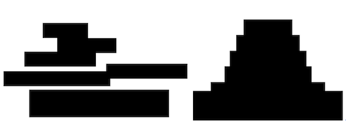分布（至少三个或者三个以上的图层）

  
````
  图层复制：ctrl+alt（option）+ 鼠标拖动
  分组快捷键：CTRL+g

````
* 3D模式（用处不大作了解使用）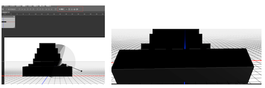


----

#### 选区工具组
----


* 快捷键：M  
* 在PS中可以通过创建选区对图像进行填充、移动、复制、变换等编辑操作。在PS操作中，用选区选取范围是比较常用的方法。建立选区以后，就可以对选区内的图像进行操作。

#### 选区的运算
1. 利用选择工具建立选区，然后利用属性面板中的运算按钮。
1. 利用快捷键，如下：

* Shift:添加选区(合并选区) 
* Alt:减去选区（删减选区）  
* shift+alt:与选区相交 

#### 羽化
* 快捷键：shift+F6
* 选区的羽化是PS中使用频率比较高的一项功能，它可以起到融合边缘的效果，实现渐变过渡边缘。
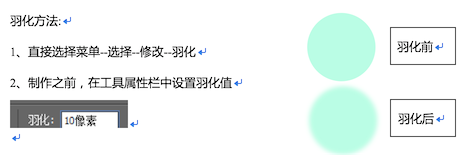

#### 消除锯齿
* 消除图像边缘部分的锯齿状，使边缘看起来比较平滑

````
  要为选区填充颜色：新建选区-》新建图层-》填充颜色；
````
#### 样式--宽度--高度
* 可以自由绘制选区，也可以固定比例，固定大小，与宽度及高度结合使用；

----

#### 调整边缘
----

----

#### 图层
----
* 图层：学习PS的人员都知道PS作图是离不开图层的操作的；在图层里面，可以加入文本、图片等，也可以自由的修改、创新，良好的分层更是有助于设计更完美的展示及修改；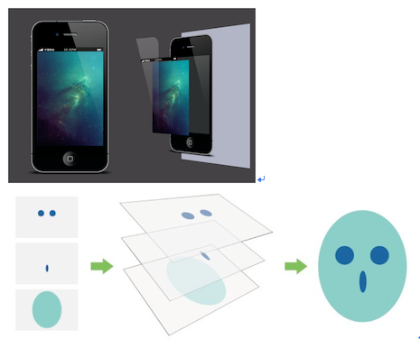
* 新建图层：可以直接点击如图所示图标，也可以使用快捷键：Ctrl+Shift+Alt+N; 

* 填充前景色:Alt+Del  填充背景色：Ctrl+Del
* 图层快捷键：Ｆ７

* 删除图层：
	1. 将图层直接拖动至删除箱
	2. 右击删除图层
	3. Del健直接删除

* 复制图层：右击复制图层或者使用快捷键Ctrl+J;
* 图层重命名：双击图层名字区域 
* 合并图层：Ctrl+E
* 合并可见图层:Ctrl+Shift+E
* 建组：Ctrl+G

----

#### 矩形选择工具
----


* 快捷键：M/Shift+M

````
   填充前景色：Alt+Delete  必须要在图层上面
	填充背景色：Ctrl+Delete  必须要在图层上面
	取消选区：Ctrl+D
	shift 可以约束等比 （拖拽边角点）,可以画等比例的宽高（正方开）；先选择区，再按shift
	alt   约束中心点
	撤销操作：
	ctrl + Z  最后两部互相切换
	ctrl + alt + Z 一直往回撤销
	ctrl + shift + Z 重做变换选区:Alt+S+T
	复制图层：
	按着ALt+鼠标拖动

````
* 案例：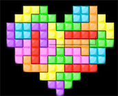

----

#### 椭圆选框工具

----

 

* 快捷键：M/Shift+M

````
调节图层顺序：
ctrl + [ 向下走一层  ] 向上走一层
ctrl + shift + [  or  ]   (直接一步到位到最底层或最顶层)
自由调节外框：ctrl + T  大小   或者 shift+鼠标拖动   
变化选区：Alt+S+T
shift 可以约束等比 （拖拽边角点）
alt   约束中心点
放大与缩小画面：
可按Alt+鼠标滚轮
放大：Ctrl+“+”
缩小：Ctrl+“-”
移动中心点：Alt健进行中心点的拖动，可利用shift健协助；

打开或隐藏标尺：Ctrl + R 
````
* 利用标尺确定画布的中心点; 视图->新建参考线->50% 
* 案例：

----

#### 单行选框工具

----
* 如图所示，打开PS，在选区工具组里，第三个就是单行选框工具，其呈现出来的状态是水平且单位为1像素的线，单击即可生成，若图片过大，需要进行放大仔细观看。

* 
 
````
复制：Ctrl+J
     Ctrl+C
粘贴：Ctrl+V
剪切：Ctrl+X－－－自动生成一个新的图层	

````
* 应用：通常可以用于制作背景效果；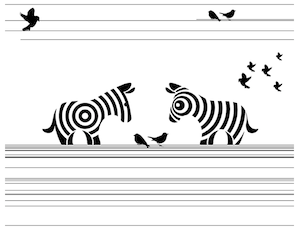


----

#### 单列选框工具

----
*  如图所示，打开PS，在选区工具组里，第四个就是单列选框工具，其呈现出来的状态是垂直且单位为1像素的线，单击即可生成，若图片过大，需要进行放大仔细观看。

````
键盘上下左右方向键可以移动图层/选区；
变换并复制:Ctrl+Alt+T  （先要选中）
重复变换：Ctrl+Alt+Shift+T
shift+点击：加选
alt+点击：减选

````
* 案例：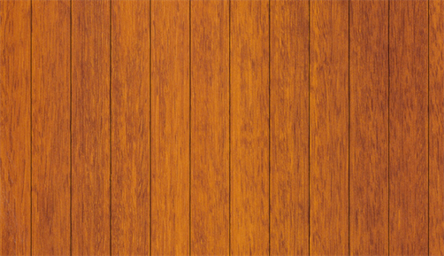

----
#### 修改选区边界
----

* 边界：用于创建将原选区边界分别向内外扩展指定宽度后生成的区域,在原有的选区上多出一个选区，填充颜色时填充两个选区中间的部分，并且呈现出羽化状态；


````
注意:
1,边界宽度值：1-200像素之间；
2,必须是在已经有选区存在的情况下，进行修改边界。如果没有选区存在，那么修改边界命令呈灰色状不能够使用。
3,与描边的区别，使用边界命令就自动羽化了，而描边命令则不会出现羽化效果。
4,如果宽度值设置为奇数，则选区的边界由蚁行线内侧选择度大于50%的像素定义。
5、如果宽度值设置为偶数，则选区的边界由蚁行线内外两侧的像素共同定义。

````
* 未设置边界效果前：
* 修改边界后：

----
#### 选区平滑效果(可以实现圆角效果)
----
* 平滑：调节选区的平滑度，边角圆滑效果,平滑选区中的尖角和锯齿；
* 菜单--选择--修改--平滑
* 默认前景色背景色快捷键：D
* 反选：Ctrl+Shift+I
* 平滑前效果：
* 平滑后效果：

----
#### 选区的扩展
----
* 扩展：原选区沿边界向外扩大指定的宽度；
* 菜单--选择--修改--扩展
* 扩展前效果：
* 扩展后效果：
* 注意：扩展会把你的选区微变化

#### 选区的收缩
* 收缩：原选区沿边界向内缩小指定的宽度；
* 菜单--选择--修改--收缩
* 收缩前的效果：
* 收缩后的效果：
* 注意：收费也会把你的选区微变化
#### 选区的羽化（可以实现类似投影、阴影效果）
* 羽化：羽化将会使选区边缘变得柔和，有自然的过渡衔接，羽化像素的尺寸将会决定选区边缘逐渐软化的区域大小。
* 快捷键：Shift+F6
* 菜单--选择--修改--羽化
* 羽化前的效果：
* 羽化后的效果：
* 把背景层变为普通图层：按着ALt双击图层缩略图 
* 后退：Ctrl+Z
* 连续撤销：Ctrl+Shift+Z
* 根据视觉习惯进行绘图：从上到下  从左到右
* 上下左右两边同时放大或者缩小：按Alt

----
#### 套索工具组
----
 

* 快捷键： L   可按shift+L进行切换
* 套索工具：主要是用来进行不规则形状的选取，利用鼠标拖拽制作选取范围；
	* 方法：鼠标左键点击不松手拖动，释放左键之后终点与起点将自动链接起来，且自动创建选区；
* 多边形套索工具：用于绘制直线型的选取范围；
	* 方法：单击鼠标左键确定起点，可松开鼠标，再选择下一处节点的位置，节点与节点之间将自动连接成选区线段，当终点与起点重合时，鼠标右下角将会出现圆圈，单击即可闭合生成选区，如果在绘制的过程中封闭选区，双击即可形成闭合选区；

````
技巧：
	1,按Shift键可以创建水平、垂直、45°角的线；
	2,如果在创建选区的过程中出错，可以按键盘上的delete即可删除刚创建的节点，也可以按esc键退出重新创建选区；
	3,套索工具和多边形套索工具可相互结合使用，在套索工具下按着Alt键不松开即可切换到多边形套索工具；

````
* 磁性套索工具：是一种比较智能的选择工具，可以自动吸附图像的边缘，沿着图像边缘产生选区，适合于抠图，但是需要选择边缘清晰、对比度明显的图像；
	* 方法：单击左键定义起点，松开鼠标，沿着图像边缘移动鼠标位置，当终点与起点重合时，鼠标右下角将会出现圆圈，单击即可闭合生成选区，如果在绘制的过程中封闭选区，双击即可形成闭合选区；

````
技巧：
	1，在绘制的过程中，若图像某处边缘不清晰，可单击鼠标人为确定下一个节点；
   2，如果在创建选区的过程中出错，可以按键盘上的delete即可删除刚创建的节点，也可以按esc键退出重新创建选区；
   3，磁性套索工具和多边形套索工具可相互结合使用，在磁性套索工具下按着Alt键不松开并单击即可切换到多边形套索工具，松开之后即可变回磁性套索工具；

````
##### 磁性套索工具属性栏:
* 宽度：检测的范围宽度，默认为10像素，若想更直观的看到检测宽度，可以按键盘上的的Caps lock切换到精确光标的方式，光标就会变成一个圆圈，就可以直观的看到宽度范围了，宽度的数值越小得到的选区越精确，可根据实际情况适当调节宽度值；
* 对比度：控制周围色与边缘色彩的反差程度，对比度数值设置1-100；若选取的图像与周围图像间的颜色对比度比较强，可设置一个较高的百分数值，反之，设置数值较低比较好；
* 频率：控制绘制过程中生成的节点数量，数值越大，速率越快，节点越多，最大值为100，默认值为57，当图片边缘比较复杂的时候，可以采用较大的频率值，来提高边缘的准确性；
* 钢笔压力： 用光笔绘图板的用户才会用到。

----
#### 快速选择与魔棒工具
----

* 
* 快捷键： W  
* 方法：选择快速选择工具，调节画笔大小，可按“{”“}”进行画笔大小的快速调节，点击并拖动鼠标选择需要选取的范围，选区会自动延伸；
* 快速选择工具属性栏 
* 选择方式：
	* 新建：加选： 减选： 
	* 注意：当没有选区时，默认的选择方式时新建，当选区建立后，自动改为添加到选区，按ALt键，可以将选择方式变为从选区中减去。
* 画笔调整：包括大小、硬度、间距，对于选区边与背景颜色反差比较多的图像，可适当将画笔笔触调大，进行快速的选择，提高效率，反之调小，进行细致的范围选取；
1. 大小：鼠标拖动三角往右将画笔放大，往左将画笔缩小；注意：右括号“】”可增大画笔的大小，左括号“【”可减小画笔的大小，在调节时，请将自己的输入法关闭；
2. 硬度：当笔头设置的硬度值越大，选区边缘就会越生硬，数值越小，变会越柔和，但是对快速选择工具的意义不大；
3. 间距：若设置的数值比较小，选区一般是连续的，若设置的数值比较大，一般是间断的，通常情况下不做特殊调整；
4. 角度：与圆度可以配合使用，如下图，当角度设置为50°时，画笔笔触将不再是水平或者垂直展现出来；
5. 圆度：可将画笔笔触变为椭圆形，但是对于快速选择工具，角度和圆度用的几率都不是很大；
6. 需要外接手绘板才可以完成制作；

##### 对所有图层取样：
* 基于所有图层创建一个选区，而不仅仅针对当前图层。
##### 自动增强
* 减少选区边界的粗糙程度，使选区向主体的边缘进一步流动，遇到选择对象的边沿有模糊的过渡色时，会做一个自动边缘调整，扩大要选择的范围；
##### 调整边缘

-----
##### 魔棒工具
----

* 快捷键： W  
* 魔棒工具:可以通过简单的操作创建选区，且选区范围是与鼠标落点处颜色相邻或相近的区域，对背景简单且颜色比较单一的图像可进行快速的选取；
* 方法：选择魔棒工具，通过鼠标单击图像颜色区域取样，可按Shift键加选，Alt键减选；

````
技巧：
   1、在选择图像时，要适时放大进行选择或加选，以免有漏选的现象发生，全部选择之后，请检查看选取的完整性；
   2、魔棒工具一般抠取背景色与主体色差比较大的图片，若背景比较复杂或与主体色差比较小或有融合的部分，可采取别的方式抠图；

````

* 魔棒工具属性栏
* 取样大小：默认为取样点，是取样点像素的大小。比如3×3，就是三个像素乘三个像素的大小；
* 容差：魔棒工具是利用色彩的容差来选择图像的范围，所以容差值设置对于魔棒工具起着非常重要的作用；容差越大，选取颜色时的色差范围越大，反之越小，取值范围：0-255，当容差值设置为0时，选区选取只能和取样颜色完全相同的颜色区域。
* 连续：选择位置相连且颜色相接近的区域，若处于勾选状态，魔棒只选择相邻区域，与图像中其他色块无关，该选择处于非勾选状态，则选择图像中所有颜色相接近的区域；
* 对所有图层取样：处于未勾选状态时，魔棒工具只从当前图层选取颜色范围，若勾选，在选取时会将文件中所有可见图层的相似颜色全部选取，如下图；


-----
##### 裁剪工具
----
 

* 快捷键： C  
* 裁剪工具:在PS作图的过程当中，往往会遇到图片大小不合适或者画布大小需要修改等问题，有时候拍摄出来的照片也需要调整其构图及大小，那我们就可以用裁剪工具移去部分图像也可以扩大画布范围，裁剪工具也可以修正歪斜的图片，大小及长宽比可手动任意拖动。
* 方法：选中PS裁剪工具，在图像中拖动选取范围，即可在图片的四角和四边会出现裁剪标识---8个控制点，并显示裁剪范围，且其他区域会变暗，选框可以在创建之后调整，利用控制点对框内范围进行放大、缩小、旋转等操作，调整完成之后双击鼠标或按回车（enter）键确定选取范围；若要取消裁剪，可以鼠标右击“取消”，也可以按快捷键Esc进行删除；

````
技巧：
   1，将鼠标放置在框内可移动选框；
   2，3:2、4:3、1:1是处理摄影图片常用选项；
````

-----
##### 透视裁剪工具
----
 
 
 * 透视裁剪工具:可以将裁剪区域调整为透视或者任意四边形，从而改变图像形态，也可以纠正不正确的透视变形，对倾斜的图片进行矫正。
 * 方法：
	* 选择透视裁剪工具，在图像当中任意拖动矩形，可以利用边缘框点进行边框的变形更改；
	* 选择透视裁剪工具，直接单击鼠标定出四个点画出任意四边形
	* 可以按Alt键更改画面中心点
	* 注意：任何变形都会导致画面的扭曲，所以变形的程度不能太大。
* 透视裁剪工具属性栏 
* 设置裁剪图像的宽度、高度及分辨率 ,在框中可以输入需要的尺寸大小
* 前面的图像：单击可以记录图像的大小及像素，可以使裁剪后的图像与之前记录的图像大小相同；
* 清除：单击可以清除设定好的宽高值及分辨率值；
* 显示网格：勾选状态是显示裁剪框的网格，不勾选则只显示外框；
* 选完以后，按enter键就可以确定最终图片；

-----
##### 切片工具
----

*   
* 快捷键： C  
* 切片工具:切片工具就是用来切割图像，学习切片工具有两方面原因：
	1. 	主要用于网页设计，改善网页加载速度，让相同的网速下网页加载速度更快，给用户良好的网页浏览体验。
	2. 设计出来的Jpg图片没有办法做链接跳转，需要切片处理添加超链接做跳转。
* 方法：选择 工具箱中的“切片工具”，在想切入的地方点击并拉动鼠标，会出现四方形的切片区域，拉到合适的位置，松开鼠标后可完成创建一个用户切片，且有蓝色数字标识,用户以外生成自动切片。同样的操作，可以继续操作下面的切片用户，操作错误，可以右击或者delete键删除切片或用切片选择工具进行修改编辑。

````
技巧：
   1,当鼠标放置在当前切片用户范围处，可直接切换切片选择工具，当鼠标移动至其他切片处，可按Ctrl键切换选择工具；
   2,隐藏切片：Ctrl+H   清除切片：Alt+V+C；如果不想同时隐藏辅助线，可以按完ctrl+H后再任意拉一条辅助线即可;
   3、按Shift可以加选切片并进行组合切片；

````
* 切片工具属性栏 
* 样式：可以改变切片工具的裁切标准：
	* 正常：随意切片，切片大小和位置取决于自己画的框；
	* 固定长宽比：根据特定的长宽比设置切片框；
	* 固定大小：固定设置切片的长宽大小；
* 宽度：设置切片的宽度；
* 高度：设置切片的高度；
* 基于参考线的切片：如果我们的文件需要参考线标注可以更加准确，我们可以执行基于参考线的切片操作，使切片精准度更高；

-----
##### 切片选择工具
----
* 
* 快捷键： C 
* 切片选择工具:当我们把图片切出来之后，可以用切片选择工具删除无用的切片，也可以变化切片的大小和位置等，也可以进行切片的排列对齐，图片的超链接等;
* 方法：
	1. 点击切片，可以根据切片边或者角点随意拉伸或收缩切片，改变大小及位置，也可选中直接按delete或右击进行删除切片；
	1. 在切片位置处右击选择编辑切片选项，或双击切片，可以调出编辑框，进行网址链接等相关信息的设置；
* 切片类型：

````
	无图像；该切片输出空白无图像可以在切片中输入HTML文本；
	图像：该切片图像输出成图像；
	表：切片导出时作为嵌套表写入到HTML文本文件中；
	名称：输入切片的名称，但是如果选择无图像，则没有名称选项；
	URL：为切片设置一个超链接地址，在浏览器单击该切片图像会跳转到相对应的网址里；
	目标：指定窗口打开位置，是原窗口打开，还是在新窗口（blank）打开链接；
	信息文本：鼠标移到这个块时浏览器左下角显示的内容；
	Alt标记：图片的属性标记，鼠标移动到这块时鼠标旁的文本信息；
	尺寸定位：定位切片的坐标和长宽；
	切片背景类型：可自选背景色填充透明区域。

````
* 存储：存储方式选择“存储为Web所用格式”

````
1、保存格式选择HTML和图像，如果选择仅限图像，只输出图像。如果选择HTML，不会显示图片，设置为默认设置，切片为所有切片；
2、CMYK模式的图片在网页上是看不到的；
3、文件名改成英文，防止有电脑识别不出来。
````

* 切片工具属性栏   
* 置为顶层：把所选薄片调到最前
*  前移一层：把所选薄片向前移动一个水平层
*  后移一层：把所选薄片向后移动一个水平层
*  置为底层： 把所选薄片调到最后
*  提升：可以将自动生成的切片提升为手动切片，对切片进行设置
*  划分：可以根据设定将切片水平垂直的继续划分成多个小切片，可以指定切片的个数或像素大小 
*   对齐：切片过多可能会造成重叠，因此我们可以用对齐功能调整切片的次序
*  分布：可以让多个切片按照一定的分布规律进行排列（与选区类似），多选切片可以按Shift键
*  隐藏自动切片：可以将自动切片进行隐藏 
*   设置切片选项： 也是进行切片选项的一种方法

-----
##### 吸管工具
----
* 
* 快捷键：I
* 吸管工具可以很好的帮助作图人员进行图像中颜色的吸取，以拾取点周围的平均色进行颜色取样且一次只能吸取一种颜色。
* 方法:点击吸管工具在想要吸取颜色的地方点击，前景色会变为所取颜色，然后就可以进行颜色填充，也可以通过颜色面板观察前景色背景色的变化及色值，吸取颜色作为当前的前景色。
* 技巧：

````
	1、按Alt键用吸管工具吸取颜色可定义为当前背景色；
	2、若希望填充颜色和图像上的某处颜色值一样，可直接选吸管工具点击某处进行取色，这样填充的颜色就和所取颜色相同；
	3、吸管工具也可以进行拷贝颜色的十六进制代码，可结合网页设计相关知识使用；
	如“fff6f0” “ color="#4d1980"f ”等
````
* 吸管工具属性栏  
* 取样大小：以鼠标吸取点为中心，进行颜色运算，取样大小设置为取样点，则是准确根据鼠标定点为基准颜色，取样大小设置为3×3平均，则是吸取此点周围三个像素的平均色。
* 样本：吸取颜色的图层范围，有五个选项，选择比较多的是所有图层或当前图层；
* 注：“所有无调整图层”，是指排除掉所有调整层之后，最终叠加效果图里取样点的颜色。

-----
##### 3D材质吸管工具
----
* 
* 快捷键：I
* 3D材质吸管工具需要结合3D图像进行使用，主要可以用来查看当前3D图像所用的材质类型，也可以进行材质类型的改变；
* 方法:选择3D材质吸管工具，单击鼠标左键选取你需要的图像区域，即可在属性栏出现材质类型，也可以在属性窗口里面更换材质；
* 3D材质吸管工具属性栏   
	* 材料油漆桶：用于材质的储存更换等
	* 载入所选材质：可以将当前所选材质存入到材料油漆桶中

-----
##### 颜色取样器工具
----
* 
* 快捷键：I
* 颜色取样器工具:可以对图像信息进行取样，帮助记录数值，可以用数值判断图片是否有颜色方面的问题，方便对比。颜色值会显示在信息面板上并自动编号，同样可以根据取样点的定义其色彩模式。
* 方法:选择颜色取样器工具在图像上所取位置单击，即可建立一个取样点，取样信息会在信息面板中保存并显示出来，图像中最多放置4个取样点，取样点位置可以按Ctrl键进行拖动，改变其位置，对于取样点可进行右击删除或者按住Alt键当鼠标变成剪刀形状点击删除或直接将其拖出画布。
* 颜色取样器工具属性栏 
	* 清除：点击可以清除图像上所有的取样点


-----
##### 标尺工具
----
* 
* 快捷键：I
* 标尺工具:使用标尺工具可以精准的测量图像当中点或线之前的信息，也可以进行图像的修正；
* 方法:选择标尺工具在图像上单击确定一个起点，拖动出一条直线，在松开鼠标的位置确定终点，此时属性栏中会自动显示出坐标轴、宽度、高度、长度、角度等信息；双击起点可以拉出第二条标尺线，当我们的图像不是很正，可以沿着倾斜边画出一条直线，点击“拉直图层”，即可让倾斜的线变水平，同时图像角度会发生一定改变。
* 技巧：

````
1，若想修改拉出的标尺位置或长度方向，可以将鼠标放置在拉出的直线顶点或直线上进行调整；
2，按键盘上的Shift键拉动，可出现水平、垂直或45°线段；
````
* 标尺工具属性栏 

````
	X：使用标尺工具拉出直线起点的X坐标轴数值；
	Y：使用标尺工具拉出直线起点的Y坐标轴数值；
	W：起点与终点拉出直线的宽度；
	H：起点与终点拉出直线的高度；
	A：使用标尺工具拉出的直线与水平线之间的角度；
	L1：标尺工具拉出的直线的长度；
	L2：标尺工具拉出的第二条直线的长度；
	
	使用测量比例：使用测量比例计算标尺数据，在图像中设置与比例单位数相等的指定像素数，创建之后可以记录结果；
	拉直图层：可用于修正歪图，让拉出的直线与水平线平行；
	清除：可清除标尺工具拉出的直线；

````  

-----
##### 注释工具
----
* 
* 快捷键：I
* 注释工具:在图像中添加文字注释及作者信息等内容，用于解释说明图像当中标注的位置信息，使其他人可以直观明了的看到注释信息，便于相关工作人员的修改。
* 方法:打开图像，选择注释工具，通过鼠标左键单击目标位置使其出现注释文本标志，即可在注释中添加文字加以说明，注释标志颜色可以根据属性栏设置修改，在作者栏中可以输入作者的名字，右击可进行删除注释。
注意：在保存的时候，保存PSD格式的文件，若保存JPG或者色彩文件，不会被保存；
* 注释工具属性栏

````
作者:用于输入用户或作者的名字
颜色：设置注释标志颜色
清除全部：清除图像当中的所有注释
显示或隐藏注释面板

````

-----
##### 计数工具
----
* 
* 123计数工具:可以统计图像中目标的个数，是一款数字计数工具，以数字标志的形式显示在画面当中，数目显示在属性栏的“计数”当中，用这款工具可以统计画面中一些重复使用的元素，是款不错的统计及标示工具。
* 方法:选择123计数工具，在目标位置左键单击，旁边即可出现一个数字，再下一个目标位置单击数字会自动按阿拉伯数字递增，并在上方属性栏中显示计数总数，若想改动数字点位置，可把鼠标放在数字的位置处出现三角光标提示，即可移动数字点。
* 技巧：

````
1，按Shift键移动数字点可进行水平/垂直方向的移动；
2，按Alt键左键单击数字点可删除数字段点；
3，保存计数文件保存为PSD格式；
4、键盘上下箭头可以调节标记与标签大小；

````
* 计数工具属性栏 

````
	计数：显示计数总数；
	计数组：可以创建新的可见计数组，在计数组名称框内可以显示；
	关闭小眼睛图标可暂时隐藏数字点，删除当前所选计数组图标可删除计数组（至少有两组可以进行删除操作）； 
	清除：可以清除图像当中的所有计数点；
	拾色器：可以设置标签颜色；
	标记大小：设置标记的大小；
	标签大小 ： 设置标签的大小；

````

-----
##### 修复画笔工具组
----
* 
* 快捷键：J
* 切换方式其他方法：Shift+J/按Alt键点击修复画笔工具组
* 修复画笔工具组里的功能在PS图像处理方面发挥很大的作用，通过把图像像素的纹理、光照、阴影等与周围像素匹配，使其更好的融合在画面当中，可以很好的美化照片人物图像等，包括污点修复画笔工具、修复画笔工具、修补工具、内容感知移动工具、红眼工具；
##### 污点修复画笔工具
* 主要用于快速修复比较小的污点和瑕疵等，操作起来简单快捷，在有瑕疵的地方单击或划动即可修复；

##### 修复画笔工具
* 用于修复图像当中的缺陷，并能使修复的结果自然的与周围像素融合在一起，需要按下Alt键从图像中取样，定义一个与修复处相近的基准点，再进行修复操作；

##### 修补工具
* 先勾勒出一个需要修补的选区，会出现一个选区虚线框，移动鼠标时这个虚线框会跟着移动到适当的位置，比如与修补区相近的区域，单击即可。
#### 内容感知移动工具
* 用来移动图片中主体，可以随意放置到合适的位置。移动后的空隙位置会被智能修复。
##### 红眼工具
* 去掉照片中由于反光产生的红眼现象

* 方法：根据作图情况，选择修复画笔工具组相应的工具，结合工具属性栏相关设置进行调节不同的参数，达到不同的修复效果。
* 技巧：通常采用修图工具会影响到本来的图像效果，建议在作图前可以先复制一层进行复件的操作；


-----
##### 污点修复画笔工具
----
* 
* 快捷键：J
* 污点修复画笔工具：主要用于快速修复比较小的污点和瑕疵等，操作起来简单快捷，在有瑕疵的地方单击或划动即可修复，且PS会自动将修复区域与周围像素自然的融入到一起，不会留下特别明显的人为修复的感觉。
* 方法：选择污点修复画笔工具，调整画笔的大小及其他相关设置，在所要修复的区域单击或轻微划动即可迅速的去除小污点或瑕疵部分；
* 技巧

````
1，此工具不适合在较大面积中使用，在修复时细心的处理瑕疵部位，避免大片范围的一次性修复；
2，适当调节画笔大小，画笔越大，画面修复速率越快但是效果会越粗糙；
3、调节笔头大小可以通过键盘上的的左右中括号键【 】进行操作；

````

* 污点修复画笔工具属性栏：

````
画笔选取器：用于调整画笔的大小、硬度、间距、角度等（详解见第25节快速选择工具）；
模式：
	可以设置修复图像与源图像之间的混合方式
	替换：可以保留画笔描边边缘处的杂色、胶片颗粒和纹理。
	其他模式在讲图层混合模式时进行讲解；
类型:
	包括“近似匹配”、“创建纹理”、“内容识别”三项，
	近似匹配：在修复图像时，以画笔定位点为基准，根据周围像素内容来修复；
	创建纹理：以画笔定位点为基准创建一些相似的纹理，进行填充修复的区域；
	内容识别：软件默认类型，在修复图像时，根据修复区域的像素内容识别，并自动填充；
对所有图层取样：
	若选择该项，修复操作是从所有可见图层中进行，若不选择，则从当前图层中进行操作；


````

-----
##### 修复画笔工具
----
* 
* 快捷键：J
* 修复画笔工具:用于修复图像中的杂斑、污点等，且图像修复处将智能的与周围像素相互融合在一起，使修复后的图像看起来比较自然美观。
* 方法:选择修复画笔工具，按着Alt键配合鼠标点击从图像中取样，在需要修复的区域进行点击或者涂抹操作即可。
* 修复画笔工具属性栏:

````
	画笔选取器：调整画笔的大小样式硬度等；
	仿制源：在仿制源面板中，可以设置5个不同的仿制源，为修复比较复杂的图片；
	模式：图像的混合模式，替换--源点处图像替换修复处图像，视觉效果基本一致。
	源：选择取样，需要按Alt键在当前的图像中单击取样作为取样点修复图像；选择图案，可选择图案直接修复图像；
	对齐：未选择对齐，取样点始终不变，即使在操作过程中松开鼠标后再次修复依然会使用初始取样点修复图像；选择对齐会对图像像素连续取样，取样点位置会跟随光标的移动发生相应的变化，不会重复复制；
	样本：用于设置从指定的图层中进行数据取样。包括当前图层、当前和下方图层、所有图层;
	打开以在修复时忽略调整图层：用于忽略调整的图层，可在实际运用中尝试调整出的视觉效果;

````

-----
##### 修复工具
----
* 快捷键：J
* 方法	:修补工具在使用的过程中会创造选区，固定出一定的区域，选区可以进行加、减、交叉的运算，也可以进行填充颜色或羽化操作使修复边缘更加平滑；首先用鼠标绘制出需要修复部位的选区，之后在选区内单击拖动鼠标移动选区至目标区域，松开鼠标即可看到修复后的效果，
* 修补工具属性栏 

````
	选区运算：新建、加、减、相交
	修补：
	正常：修复区域与目标区域混合融合在一起；
	内容识别：修复区域与周围内容混合融合在一起；
	
	源：选区内的像素会随着鼠标移动的目标位置的像素产生更改；
	目标：目标位置的图像将被更改为取样选区内的像素内容；
	透明：选区中的图像与目标位置图像产生透明叠加的效果，若不选择，被修补的区域与周围图像只在边缘上融合，内部图像纹理不变；
	使用图案：建立选区后，使用图案便可使用，否则默认灰色不可用，选定一种图像当中；

````

-----
##### 内容感知移动工具
----
* 
* 快捷键：J
* 通过内容感知移动工具，可以智能的将选区内的像素移动到目标位置，可以迅速的改变选区内容的位置，且移动后的边缘会自动的与周围环境融合在一起。
* 方法:选择内容感知移动工具，用鼠标选取需要移动的区域，可以选择属性栏中的模式：移动或扩展，将鼠标放进选区内部，即可进行移动扩展；
* 技巧:选区内部也可进行填充修复，快捷键：Shift+F5
* 内容感知移动工具属性栏

````
	选区运算:基本的选区运算，新建、加、减、相交；
	模式：包括移动和扩展；
	移动：将选区内容移动到目标位置，并智能的与周围环境融合在一起；
	扩展：将选区内容复制移动到目标位置，选区内容位置不变；
	适应：共五项可以选择，“非常严格”会严格的限定取样的周边范围，“非常松散”使取样周围的像素内容变得缓和，在更大的范围内进行取样。
	对所有图层取样:

````

-----
##### 红眼工具
----
* 
* 快捷键：J
* 红眼工具可以用于修饰数码照片的工具，可以移去用闪光灯拍摄的人物或动物照片中的红眼效果；
* 方法：选择红眼工具，可以通过鼠标直接点击需要修复的红眼区域；
* 红眼工具属性栏 
	* 瞳孔大小：设置瞳孔指示的大小；
	* 变暗量：设置去除红眼后瞳孔变暗的程度，数值越大，则去除红眼后的瞳孔越暗；


-----
##### 画笔工具

----

* 快捷键：B
* 画笔工具：用于绘图的工具，可以表现出多种形态的图案效果，是PS软件常用工具之一。
* 方法：选择画笔工具，可以通过属性栏调整画笔的软硬度及其他相关设置，完成后可直接通过点击，或鼠标拖动在画布中绘制；
* 安装笔刷方法：
	* 下载自己所要用的笔刷形态，打开画笔预设面板，通过齿轮设置按钮，找到“载入画笔”，载入你的笔刷文件即可，文件后缀名.abr，同样可以选择笔刷右击删除画笔；
	* 直接将下载下来的画笔拖入到PS软件当中，重新打开PS即可；
* 技巧

````
	打开画笔面板快捷键：F5
	鼠标右击也可以快速的打开画笔面板
	降低画笔的硬度：Shift+[   增大画笔的硬度：Shift+]
	按shift键绘制可绘制垂直或水平的线段
	] 放大画笔； [ 缩小画笔
   可以用画笔工具绘制立体球
````
* 画笔工具属性栏 
	* 画笔预设选取器：可以调整画笔笔尖形态及画笔大小、软硬程度，也可以通过设置载入自己所需要的其他画笔笔刷；
	* 模式：定义绘图色与底图的混合模式；
	* 不透明度：设置画笔颜色整体的不透明度，取值范围1%-100%，1%达到完全透明的状态；
	* 流量：画笔颜色的浓度，单独笔触的不透明度；
	* 喷枪：鼠标点击不松手喷枪会不断喷出颜色，保持时间越长，颜色越深面积越大；
	画笔预设面板
* 画笔预设面板 
* 画笔笔尖形状:包括笔尖形态，大小等；
	* 翻转X：改变画笔笔尖在X轴的方向；
	* 翻转Y：改变画笔笔尖在Y轴的方向；
	* 角度：椭圆的倾斜角度，可以通过拖动滑块或者输入数值进行调节；
	* 	圆度：椭圆的长短直径的比例设置，可以通过拖动滑块或者输入数值进行调节，100%时是正圆，0%时椭圆外形最扁平；
	* 硬度：画笔边缘的软硬程度，可以决定画笔边缘的过渡效果，数值越小，画笔边缘越模糊；
	* 间距：控制画笔笔尖之间的距离，数值越大，间距越大，反之越小；

* 形状动态
	* 大小抖动：控制画笔大小抖动的变化程度；
	* 控制:确定画笔笔迹变化的方式；
	* 渐隐：逐渐消隐，可以在后面的数值输入框中输入一个数值，以确定尺寸波动的步长值，如图所示：（“钢笔压力”、“钢笔斜度”、“光笔轮”3种方式都需要有压感笔支持） 
	* 最小直径：画笔的最小尺寸，数值越小，发生波动变化越大，反之越小；
	* 倾斜缩放比例：当选择“控制”下方的“钢笔斜度”，该项才可使用；
	* 角度抖动：控制画笔笔迹的角度变化，数值设置越大，波动的幅度也越大；
	* 圆度抖动:控制画笔笔迹圆度的变化，数值越大，波动的幅度也越大；
	* 最小圆度：圆度抖动打开之后才可使用，控制画笔笔迹的最小圆度，百分数越大，发生波动的幅度相应变小；
	* 翻转X抖动、翻转Y抖动：设置画笔笔尖在X轴、Y轴的方向；
	* 画笔投影：给画笔笔迹加轻微投影，并不明显；
* 散步 

````
	散步：控制画笔笔迹位置分布及偏离程度，百分数也大，偏离程度越大；
	两轴：画点在X和Y两个轴向上发生分散。   
	控制：控制画笔笔迹的分散方式；
	数量：设置分散画笔笔迹的数量，数值越大，笔迹越多；
	数量抖动：分散画笔笔迹的变化程度，百分数越大，笔迹数量的波动幅度越大； 

````
* 纹理:设置画笔与图案纹理相混合的方式；

````
	纹理调板：单击纹理调板，可以选择所需要的纹理图案；
	反相：取反相纹理，图案中的颜色进行反相处理，亮区变暗，暗区变亮；
	缩放：图案的大小缩放比例；
	亮度：纹理的明暗程度；
	对比度：纹理明暗的对比度；
	为每个笔尖设置纹理：把选择的纹理单独应用于画笔的每个笔迹，而不是应用于整体，只有打开，才能设置最小深度和深度抖动；
	模式：确定纹理和画笔的混合模式；
	深度：设置纹理显示的深度，数值越大，纹理越明显；
	最小深度：控制纹理的最小深度；
	深度抖动：设定深度的变化程度； 
````
* 双重画笔

````
	可以设置两种画笔的混合效果；
	模式：设定两种画笔的混合模式；
	大小：控制叠加画笔的大小；
	间距：设定叠加画笔的间距；
	散步：设定叠加画笔笔尖的分散程度；
	数量：设定叠加画笔笔迹的数目；

````

* 颜色动态:用于设置画笔在绘制过程中颜色的动态变化；

````
	前景/背景抖动：设置画笔颜色在前景色和背景色之间的变化程度，数值越大，越接近于背景色，反之越接近于前景色；
	色相抖动：画笔笔迹颜色色相的变化程度，数值越大，越接近于背景色色相，反之越接近于前景色色相；
	饱和度抖动：设置画笔笔迹颜色的饱和度变化；
	亮度抖动：设置画笔笔迹颜色亮度的变化程度；
	纯度：控制画笔纯度；

````
* 传递：

````
	不透明度抖动：控制画笔笔迹不透明度的变化方式，随机性比较大；
	流量抖动：控制画笔颜色的浓度变化的方式，数值越大，效果越明显；
	湿度抖动、混合都懂：只有在混合器画笔工具中才能使用；
````

* 画笔笔势:毛笔笔刷效果会比较明显； 

````
	倾斜X、倾斜Y：画笔根据X、Y轴进行倾斜；
	旋转：根据画笔笔芯进行旋转；
	压力：根据压力数值设置的不同达到不同的效果；

````
* 杂色:在笔刷的边缘产生杂边，和硬度有一定关系，硬度越小，杂色越明显；
* 湿边:笔迹边缘颜色加深，有水彩效果感觉；
* 平滑:在快速绘图过程中，使绘制的图像边缘较平滑；

-----
##### 铅笔工具
----

* 
* 快捷键：B
* 铅笔工具可以绘制出的线条是硬的、有棱角的，曲线或斜线都会根据像素格子产生明显的锯齿，与硬度值的设置无关，颜色设置为前景色；
* 方法：选择铅笔工具，可直接设置笔尖的大小，快捷键：缩小【、放大】，也可以直接通过画笔面板调节，选择铅笔形态，即可绘制；
* 技巧：
	* 当画笔笔触为1像素时，会形成一个小方块，可以用小方块绘制像素图形；
	* 在绘制过程中按Alt+Shift键能迅速转换为变成颜色取样器工具，加鼠标右键不松手可以改变前景色颜色；

* 铅笔工具属性栏
	* 画笔、模式、不透明度与画笔相同，可通过画笔笔记和视频了解；
	* 自动抹除：勾选自动抹除后，当第一次使用铅笔工具绘图时，颜色直接使用前景色，接着在此前景色基础上绘制，会填充为背景色；

-----
##### 颜色替换工具
----

* 
* 快捷键：B
* 颜色替换工具:运用此工具可以很好的用前景色替换图像的颜色，并且能够保留原有的材质纹理与明暗基调；
* 方法:确定前景色后，鼠标起点的像素颜色为基准色，调整相关的属性设置，在图像中需要更改颜色的地方涂抹即可；
* 颜色替换工具属性栏

````
画笔预设
模式：用于选择混合模式
包括色相、饱和度、颜色、明度

取样：
连续：以鼠标所在的位置像素颜色为基准对颜色连续取样； 
一次：每次操作鼠标不松手只替换鼠标点击的区域目标颜色；
背景色板：替换与背景色颜色相同或相似的像素；
限制：
不连续：替换出现在鼠标点击下任何位置的样本颜色；
连续：替换与鼠标点击颜色邻近的颜色；
查找边缘：主要替换在色彩区域间的边缘部分，更好的保留形状边缘的锐化程度；
容差：设置1-100之间的整数，数值越大，选取颜色范围越广；
消除锯齿：使边缘变得平滑；
该工具不适用于“位图”“索引”“多通道”颜色模式的图像；

````

-----
##### 混合器画笔工具

----
* 
* 快捷键：B
* 混合器画笔工具可以模拟真实的绘画技术，可以混合画布上的颜色，也可以调整不同的绘画湿度，绘制出艺术画的效果；
* 方法:选择混合器画笔工具，调整画笔的笔触、颜色、潮湿度等，即可开始绘制，在绘制的过程中，可以不断的调整笔触形态，已达到更好的效果；
* 技巧
	* 按Alt键可以选取颜色并载入；
	* 按下Ctrl+Alt+Shift的同时，按下鼠标右键，也可选取颜色；
* 混合器画笔工具属性栏
	* 画笔库：调节画笔笔刷大小等；
	* 当前画笔载入：显示出前景色的颜色，点击可以改变颜色色值，也可以吸取画面当中的颜色；点击小三角，出现载入画笔、清理画笔、只载入纯色；
	* 每次描边后载入画笔：控制每一笔绘制之后画笔是否自动载入；
	* 每次描边后清理画笔：选择之后系统将之前载入的画笔清除；
	* 有用的混和画笔组合：用于设置不同混合预设效果，包括4组：干燥、湿润、潮湿、非常潮湿等，当选择其中某一种时，右边的4个数值会自动为预设值；
	* 潮湿：设置从画布拾取的油彩量，设置的值越大，画在画布上的色彩越淡；
	* 载入：设置画笔上的油彩量；
	* 混合：设置颜色混合的比例，当潮湿为0时，该选项不能用；
	* 流量：设置描边的流动速率；
	* 启用喷枪样式的建立效果：当鼠标点击画布画笔停留在某一位置时，会一直有颜色喷出来的感觉；
-----
##### 仿制图章工具

----
* 
* 快捷键：S
* 仿制图章工具也可以对图像进行修复，能够选择取样点，根据涂抹的范围复制全部或者部分到一个新的图像中，复制出来的图像与原图是完全一样的；
* 方法：选择仿制图章工具，按着Alt键，用鼠标在图像中通过点击定义取样点，在修复目标处拖动涂抹即可复制新的图像{像画笔一样也可以选择笔触形态}；
* 仿制图章工具属性栏
	* 对齐：选择对齐松开鼠标后，当前的取样点不会丢失，取样点会根据你鼠标的移动产生变化，若取消选择，则每次松开鼠标重新绘制，都将应用初始取样点；
其他属性不再做解释，可参考之前学习的内容；

-----
##### 图案图章工具

----
* 
* 快捷键：S
* 图章工具可以选用特定图案进行填充，也可以先自行定义图案进行填充；
* 方法：选择图案图章工具，设置好属性栏相关参数及图案，在画布上直接进行涂抹就可以出现设定的图案效果，绘制出的图案会重复排列。
* 图案图章工具属性栏
	* 印象派效果：勾选后，图像会产生印象派绘画效果；
	* 可以利用图案进行绘画，可以从图案库中选择图案或者自己创建图案；

-----
##### 历史记录画笔工具

----
* 
* 快捷键：Y
* 历史记录画笔工具能够记录图像中每一步的操作，还原操作图像本来的状态，也可以将部分图像恢复到被指定的某一步操作；
* 方法：在对于图像调整之后，选中历史记录画笔工具，调整合适的笔刷及其他属性，进行擦拭或者涂抹，就可恢复原来的状态；
* 历史记录画笔工具属性栏

-----
##### 历史记录艺术画笔工具认识

----
* 
* 快捷键：Y
* 历史记录艺术画笔工具能恢复被修改的图片，也可以对图像进行特殊的效果处理，创建不同的色彩和艺术风格；
* 方法:若想恢复图片本来的效果并带有艺术效果的感觉，可以选中修改过的图片，选中历史记录艺术画笔工具，调整其笔刷、模式、不透明度、样式等属性，即可在画面当中进行绘制；
* 历史记录艺术画笔工具属性栏
	* 样式：用于控制画笔绘制的形式；
	* 绷紧短效果:
	* 绷紧中效果：
	* 绷紧长效果:
	* 松散中等效果：
	* 松散长效果：
	* 轻涂效果：
	* 绷紧卷曲效果:
	* 绷紧卷曲长效果：
	* 松散卷曲：
	* 松散卷曲长：

	* 区域：指定绘画描边所覆盖的范围，数值越大，覆盖的区域越大，数量越多，数值设置范围为0-500间的整数；
	* 容差：控制绘画描边的区域，容差越低，选取的颜色范围越小；

-----
##### 橡皮擦工具
----
* 
* 快捷键：E
* 橡皮擦工具:可以用来擦除画面中不需要的区域，也可以达到修复画面图像的效果；
* 方法：选择橡皮擦工具，可直接对画面进行操作，适当的调整画笔及其他参数设置；
* 技巧：
	1. 在擦拭的过程中，按Alt键再被擦拭区域涂抹可以恢复图像（类似于历史记录画笔工具）；
	2. 若图像为背景图层，则擦去的部分会被背景色所填充，若图像为普通图层，则擦掉的部分变为透明区域；
* 橡皮擦工具属性栏
	1. 画笔：改变画笔的笔刷样式等；
	2. 模式：包括画笔、铅笔、块；
	3. 画笔：可以改变笔刷软硬样式等；
	4. 铅笔：边缘比较生硬；
	5. 块：橡皮擦擦拭的时候会显示出方块的状态，选择块模式，画笔是不能用的状态；
	6. 不透明度：定义擦除强度；
	7. 流量：指定流动速率；
	8. 喷枪：在画笔模式中，单击喷枪按钮将画笔用作喷枪；
	9. 抹到历史记录：抹除图像以存储的状态或快照，若勾选，则橡皮擦工具就有历史画笔工具的效果，能使改变后的图片恢复为原来的样子；

-----
##### 背景橡皮擦工具
----
* 
* 快捷键：E
* 背景橡皮擦工具也是擦除工具，在擦除的时候更加智能化一些；
* 方法：选择背景橡皮擦工具，在需要擦除的部位进行涂抹，注意将十字擦头放入被修改的区域，防止影响其他颜色；
* 技巧：
	1. 若擦拭的图像为背景图像，则擦拭后自动转化为普通图层；
	2. 十字圈，擦物体边缘的时候，即使画笔覆盖了物体及背景，只要圈里的十字在背景的颜色上，背景会就会被删除掉而不影响主体物；
* 背景橡皮擦工具属性栏

````
	取样：连续、一次、背景色板；
	连续：取样点随着鼠标移动连续取样抹除，如果按着鼠标不放的情况下，鼠标中心所接触的图像颜色基本都可以被擦拭；
	一次：以鼠标每一次点击取样的颜色为基准色或近似色进行抹除，在未松开鼠标之前，其他颜色将不被抹除；
	背景色板：将图像中与背景色一样或相似的颜色进行抹除；
	限制：不连续、连续、查找边缘；
	不连续：可以擦除画笔移动范围内与样本颜色相近没有连续起来的颜色；
	连续：将像素连续起来的位置可以进行擦除；
	查找边缘：保留边缘效果进行擦除颜色；
	容差：选取擦除图像的颜色精确度；值越大，擦除颜色范围越大，容差值越小，擦除颜色范围越小；
	保护前景色：勾选后，橡皮擦在擦拭的过程中可以保护与前景色相同的颜色不会被擦除，若不想删除图像中的某种颜色，把它吸取设置为前景色就可以了；

````

-----
##### 魔术橡皮擦工具
----

* 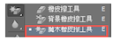
* 快捷键：E
* 魔术橡皮擦工具可以通过设定范围将像素颜色进行区域型擦除，擦除的部分将以透明的状态呈现出来；
* 方法:魔术橡皮擦工具通过设置容差值来擦除背景，通过鼠标单击取样点，取样容差范围内的像素即成为透明。
* 技巧:
	1. 魔术橡皮擦在用于初始建立的背景时，背景会自动转为图层；
	2. 对于背景比较复杂的图像，若使用魔术橡皮擦擦除，会产生凌乱的色块效果，不建议使用；
* 魔术橡皮擦工具属性栏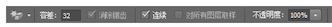

````
	容差：设置颜色的取值范围，容差越大，取值范围越宽，擦除面积越大；
	消除锯齿：魔术橡皮擦擦拭之后会有明显的锯齿感觉，此功能可以在使擦除之后的主体边缘锯齿变弱变小；
	连续：勾选后，擦除在容差选择范围内连续的颜色；不勾选时，会擦除图像内所有容差值选择的范围颜色；

````

-----
##### 渐变工具
----

* 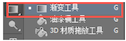
* 快捷键：G
* 渐变工具可以创建多种颜色的混合状态，利用渐变工具可以为图像填充比较融合的过渡的颜色效果，总共包含五种不同的渐变类型：线性渐变、径向渐变、角度渐变、对称渐变、菱形渐变；
* 方法：选择渐变工具，可以调整前景色背景色，也可以直接打开渐变编辑器对色标不透明度的定位等作调整，选择渐变类型，可以在画面中利用选区固定区域，以鼠标落点为渐变起点的位置，拖移定义终点的位置，实现从一种颜色到另一种颜色的过渡变化；
* 技巧：
	* 如果在画面中没有定义固定选区，则渐变色会填充到当前整个图层上；如果有选区，则会填充到选区当中；
	* 很多比较立体的图案效果及背景效果的打造都可以借用渐变工具；
* 渐变工具属性栏：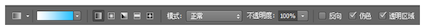
* 渐变编辑器: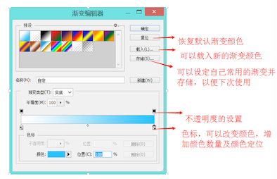
* 线性渐变：从起点到终点有直线渐变的效果；
* 径向渐变：以起点为圆心，起点到终点的距离为半径，创建圆形渐变的效果；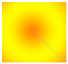
* 角度渐变：以起点为圆心，以拖动光标的角度线为源进行360度旋转的锥形渐变效果；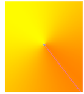
* 对称渐变：以光标落点处与拖动方向相垂直的直线为轴，进行对称渐变；
* 菱形渐变：创建以光标落点处为圆心，拖动光标的距离为半径的菱形渐变效果；
* 模式：用来设置渐变色与下面图像的混合模式；
* 不透明度：设置渐变效果的不透明度；
* 反向：颠倒渐变颜色设置的顺序；
* 仿色：使渐变颜色之间的过渡更加平滑柔和；
* 透明区域：默认勾选，勾选后“渐变编辑器”窗口中不透明度的设定才会生效，“否则，即使透明度色标设置有一定的透明度，也做不出透明的效果；
* 案例练习：
* 渐变工具可以做：立体球
* 注意：渐变工具要固定选区，否则整个画布会渐变

-----
##### 模糊工具
----

* 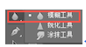
* 无快捷键
* 模糊工具可以对图像进行模糊处理，降低像素之间的反差，突出主体部分，一般用于对图像的微调；
* 方法：打开图像，直接选择模糊工具，在需要进行模糊的图像位置左单击开始涂抹，根据实际情况调整画笔样式及模糊强度等属性，再图像位置涂抹次数越多越模糊；
* 技巧：
	* 模糊工具可以对人像皱纹部位进行微调；
	* 设计人员经常会使用模糊工具做场景模糊的效果；
	* 注意把握，使用过多容易使图像失真；
* 模糊工具属性栏 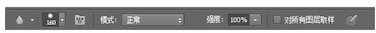
* 强度对比：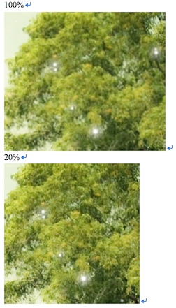
* 场景调整前：
* 场景调整后：

-----
##### 锐化工具
----
* 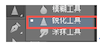
* 使用锐化工具可以使模糊的图像越来越清晰，像素对比更加强烈，多用于提高图像的清晰度，与模糊工具产生相反的效果；
* 方法:选择锐化工具，在图像需要锐化部分进行涂抹；
* 技巧：锐化强度适度调节，不要太大，以免失真，出现杂点像素；
* 锐化工具属性栏：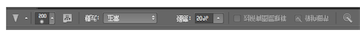
* 强度：调节锐化的程度；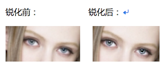

-----
##### 涂抹工具
----
* 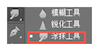
* 涂抹工具使画面有涂抹的效果，可根据边缘位置的颜色进行拖动涂抹，鼠标可控制涂抹的强度与方向，常用于修正物体的轮廓，制作背景、火苗、毛发丝等等；
* 方法：选择涂抹工具，调整合适的画笔样式及软硬程度，强度可在作图过程中做适当的调整，用鼠标控制涂抹的对象及方向；
* 技巧：涂抹时强度在最初不要设置的过于强烈，否则涂抹粗来的画面会比较假；
* 涂抹工具属性栏：
* 手指绘画：未勾选时，可以进行每次描边的起点处所指的颜色进行涂抹，勾选时，可使用每个描边起点处的前景色进行涂抹。
* 案例显示：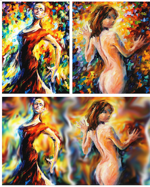
 
-----
##### 减淡工具
----
* 
* 快捷键：O
* 减淡工具可以使图片颜色减淡，画面有提亮的效果，能够增强图片的质感与美感，减淡工具的范围包括暗调、中间调、高光，在作图的过程中可以为素材图片定义三个层次，即黑白灰，对应不同的层次可以选择不同的范围进行操纵；
* 方法：将所要提亮的素材拖入到画布当中，选择减淡工具，调整好范围层及曝光度，可以进行操作；
* 技巧
	* 高光：减淡后饱和度较高；
	* 中间调：减淡后饱和度较柔和；
	* 阴影：减淡后饱和度较低，反复涂抹后，颜色会趋于白色；
* 减淡工具属性栏：
	* 曝光度:调整图像处理的曝光程度，曝光值建议设置偏小；
	* 保护色调：防止颜色产生色相的偏移；
* 案例显示：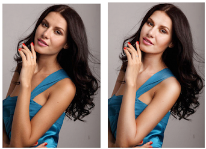

-----
##### 加深工具
----
* 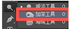
* 快捷键：O
* 加深工具与减淡工具相反，可以将图像变暗，颜色加深；加深工具的范围包括暗调、中间调、高光，在作图的过程中可以为素材图片定义三个层次，即黑白灰，对应不同的层次可以选择不同的范围进行操纵；
* 方法:将所要修改的素材拖入到画布当中，选择加深工具，调整好范围层及曝光度，可以进行操作；
* 技巧
	* 阴影：饱和度比较高；
	* 中间调：饱和度较柔和；
	* 高光：呈灰色，饱和度较低，曝光度越高，灰色越暗；
* 加深工具属性栏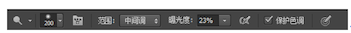
	* 曝光度:调整图像处理的曝光程度，曝光值建议设置偏小；
	* 保护色调：防止颜色产生色相的偏移；
* 案例显示：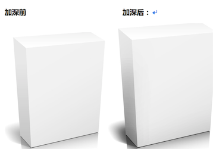

-----
##### 海绵工具
----
* 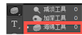
* 快捷键：O
* 海绵工具可以加深或降低（去除）图像的色彩饱和度，包括降低饱和度(去色)和饱和两个模式，但是海绵工具不能应用于索引颜色和位图颜色模式 ，如果在灰度模式下操作将会产生增加或减少灰度对比度的效果。    
* 方法:选择海绵工具，设置画笔选项，选择降低饱和度/饱和，调整流量大小（流量越大效果越明显）即可；
* 技巧
	* 降低饱和度和饱和可以互补，当饱和度过低，可以切换到饱和模式增加色彩饱和度（无法调整已经完全呈现灰度的像素）；
	* 色彩饱和度越高，表现越鲜明，饱和度较低，则较暗淡；
	* 开启喷枪方式可产生持续的操作效果。
* 海绵工具属性栏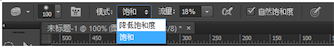
* 模式：
	* 降低饱和度：稀释颜色的饱和度 
	* 饱和：增强颜色的饱和度 
* 流量：相当于颜料的流出速度
* 自然饱和度：可以默认勾选，让色彩过渡的更自然；
* 案例显示：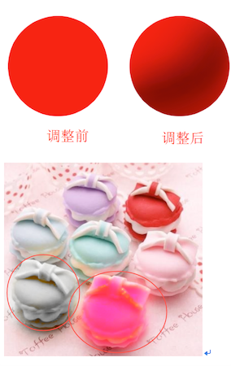


-----
##### 钢笔工具
----
* 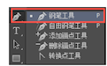
* 钢笔工具是我们最常用的工具之一，其功能也是非常强大，可以用来抠图、绘画，其可以绘制出封闭或不封闭的矢量图形，称为路径，我们使用钢笔工具可以绘制出直线也可以绘制平滑的曲线，在线段上有一定的控制节点，我们可以通过节点调节自己需要的线条。
* 方法:选择钢笔工具，在画布中可以随意确定一个点，鼠标左单击，在另外一个区域点击一个点，两点之间就会有线段相连，若在下一个位置左单击不松开鼠标继续拖动锚点将会出现平滑的曲线，如图，小节点我们可以称锚点，通过调节锚点修改平滑程度；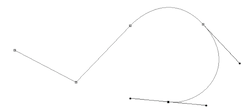
* 绘制封闭路径：多次绘制线段之后将鼠标末点与起点相连，在闭合时，将鼠标箭头紧挨着路径起点，当出现一个小圆圈时，单击鼠标，可以将路径闭合；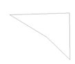
* 绘制开放路径：多次绘制将要完成时，可以直接单击工具栏中的钢笔工具按钮结束绘制，也可以按Ctrl键在画布任意位置单击；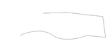
* 技巧：
	* 在绘制过程中按Shift键可以绘制出45°、90°或水平、垂直的线段，如图；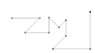
	* 若为勾选自动添加/删除，可以在绘制中通过鼠标右击路径上某点，在弹出的菜单中选择添加或删除锚点选项； 
* 钢笔工具属性栏: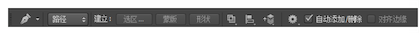
	* 路径模式：路径显示的线段
	* 建立
	* 选区：将所绘制的路径转化为选区，且可以设置羽化值；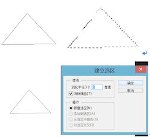
	* 蒙版：将所绘制的路径为原来图像添加蒙版操作；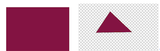
	* 形状：将所绘制的路径转化为形状，即可填充颜色等作形状的相关操作；
	* 路径操作：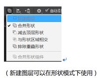
	* 合并形状：可多次绘制路径，且所画路径自动合为同一图层；
	* 减去顶层形状：将再绘制的路径与原路径重叠的部分减去；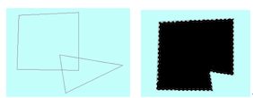
	* 与形状区域相交：将再绘制的路径与原路径相交的部分保留；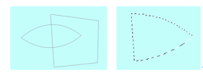
	* 排除重叠形状：将在绘制的路径与原路径重叠的部分删除；
	* 合并形状组件：可以将多条路径合并为一条路径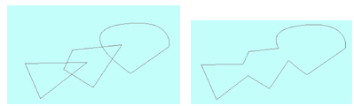
	* 路径对齐方式：配合路径选择工具可以进行对齐操作（详情见路径选择工具）；
	* 路径排列方式：配合路径选择工具可以进行对齐操作（详情见路径选择工具）；
	* 橡皮带：勾选此选项，可以更直观的看到下一个锚点定义出的路径线段效果；
	* 自动添加/删除：在绘制过程中通过单击线段上的任意一个位置可以对绘制出的路径上的锚点进行添加，通过单击原有的锚点可以将其删除，可以调节锚点达到我们所期望的线段效果；
* 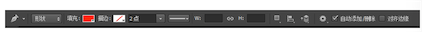
	* 形状模式:选择形状模式在绘制时不仅产生路径效果，同时在图层中创建了一个形状图层，我们可以通过属性改变形状的样式等；
	* 填充：可以将形状填充为所选颜色，包括颜色填充、渐变填充及图案填充；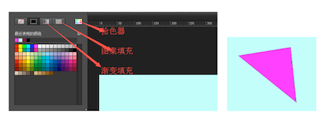
	* 描边：描边也可以选择不一样的填充效果，包括颜色填充、渐变填充及图案填充；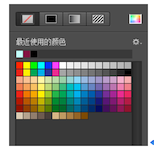
	* 其次，描边可以更改粗细；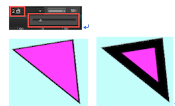
	* 描边选项：可以调节描边的类型，虚线/实线，也快以调节边角及端点的平滑程度，及虚线线段之间的间隔程度；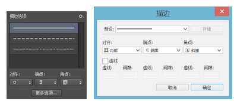,如图：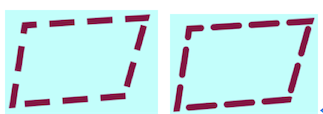
	* 新建形状：可以在不改变原有任意一个形状的情况下，绘制一个新的形状

-----
##### 自由钢笔工具
----
* 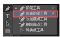
* 快捷键：P  
* 自由钢笔工具:可以自由的在画布当中画出路径，线段没有一定的规律可循，绘制完也可以对锚点进行针对性的调节；
* 方法:选择自由钢笔工具，勾选“磁性的”，即可自动吸附物体边缘进行抠图；
* 自由钢笔工具属性栏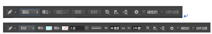
	* 磁性的：自由钢笔工具结合磁性工具时就会根据自动寻找物体边缘的，类似磁性套索!

	
-----
##### 添加锚点工具
----

* 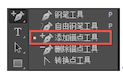
* 方法：画出路径后，如若需要对路径进行修改，可以选择添加锚点工具，在路径上点击自动会生成一个新锚点（也可以通过右击进行添加锚点的选择），可进行多次点击生成多个锚点；
* 技巧：
	* 按着Ctrl键选择锚点可以单独对锚点进行调整修改
	* 按着Alt键选择路径可以进行路径的复制；
	* 按着Alt点击已有的锚点位置可以快速切换到删除锚点的操作；

-----
##### 删除锚点工具
----

* 
* 方法：画出路径后，如若需要对路径进行修改，可以选择删除锚点工具，在路径当中的锚点上点击会自动删除所点位置处的锚点，可进行多次删除无用的锚点；
* 技巧：
	* 按Alt键点击路径可进行快速切换到添加锚点的操作；
	* 按着Ctrl+Alt可以复制当前路径；
	* 按着Ctrl键可以修改调整锚点；

-----
##### 转换点工具
----
* 
* 转换点工具:用钢笔工具抠图往往需要经过很多的修改，此时必不可少的工具就是转换点工具，通过转换点工具，可以抠出更加精准的图像；
* 方法:在创建路径后，用转换点工具单击出锚点，当拖动单独的锚点，会出现曲率调杆
可以通过调节该锚点处曲线的曲率，更改路径；
* 曲率有三种节点：
	* 角点：无曲率调杆的节点；
	* 平滑点：两侧曲率一同调节的节点；
	* 平滑点：两侧曲率分别调节的节点；
* 技巧：
	* 按着Ctrl键可以进行移动锚点的操作；
	* 选择转换点工具，单击有两侧曲率的锚点，可以迅速转化为无曲率调杆方式；
	* 按着Alt键，可以使两侧曲率一同调节的锚点单独调整；
	* 按着Ctrl+Alt键，可以复制当前路径；

-----
##### 横排文字工具
----
* 
* 快捷键： T   
* 横排文字工具输入文字成横向排列；
* 方法：
	* 单击文字工具，然后在画布中单击即可输入文字了，此时文字颜色以前景色的文本颜色的，换行按回车键；
	* 文字输入后就要对其作必要的更改了，如大小、字体等，仍选用文字工具，然后在刚才输入的文字上单击一下，此时光标在单击的地方一闪一闪的，这样就可对作修改了，如改错字、颜色等，连续击鼠标就可以选中所有文字；
	* 段落文本用法：选用文字工具后，在图片中用鼠标拖出一个文本框，此时可输入文字了，也可以复制一些，双击文本可选中所有文字；

-----
##### 直排文字工具
----
* 
* 快捷键： T 
* 直排文字工具 输入文字成竖向排列
* 方法：
	* 单击文字工具，然后在画布中单击即可输入文字了，打出的文字是竖向排列，此时文字颜色以前景色的文本颜色的，换行按回车键；
	* 文字输入后就要对其作必要的更改了，如大小、字体等，仍选用文字工具，然后在刚才输入的文字上单击一下，此时光标在单击的地方一闪一闪的，这样就可对作修改了，如改错字、颜色等，连续击鼠标就可以选中所有文字；
	* 段落文本用法：选用文字工具后，在图片中用鼠标拖出一个文本框，此时可输入文字了，也可以复制一些，双击文本可选中所有文字；


-----
##### 横排文字蒙版工具
----
* 
* 快捷键： T   
* 横排文字蒙版工具:输入文字成横向排列；文字的显示方法是选区
* 方法：单击横排文字蒙版工具，然后在画布中单击即可输入文字了，打出的文字是横向排列，并且当你确认的时候，文字是以选区的形式出现的；注：为了和横排文字工具区分开当你选择横排文字蒙版工具点击输入文字时，画布的背景会变成红色；快速蒙版启用后也是红色的，这属于正常现象；
* 注意：横排文字工具打出光标以后输入文字完成之后形成的是文字的图层（会自动新生成一个图层，并把文字放在这个图层里）而横排文字蒙板工具打上光标输入文字之后，并不会生成新的图层，也不会生成真正的文字，而是基于刚刚输入的文字形成相应的选区，即可以用这个工具打出文字形状的选区，可以借助这个选区再来填色或做其他操作
* 备注：文字以选区的形式出现，alt+delete填充前景色，ctrl+d取消选区

-----
##### 直排文字蒙版工具
----
* 
* 快捷键： T  
* 直排文字蒙版工具 输入文字成竖向排列；文字的显示方法是选区
* 方法：单击直排文字蒙版工具，然后在画布中单击即可输入文字了，打出的文字是竖向排列，并且当你确认的时候，文字是以选区的形式出现的；注：为了和横排文字工具区分开当你选择横排文字蒙版工具点击输入文字时，画布的背景会变成红色；快速蒙版启用后也是红色的，这属于正常现象；
* 注意：直排文字工具打出光标以后输入文字完成之后形成的是文字的图层（会自动新生成一个图层，并把文字放在这个图层里）而直排文字蒙板工具打上光标输入文字之后，并不会生成新的图层，也不会生成真正的文字，而是基于刚刚输入的文字形成相应的选区，即可以用这个工具打出文字形状的选区，可以借助这个选区再来填色或做其他操作。
* 备注：文字以选区的形式出现，alt+delete填充前景色，ctrl+d取消选区

-----
##### 路径选择工具
----
* 
* 快捷键：A
* 方法:在画好的路径上点击一下会出现实心锚点，可以选择整条或者多条路径进行移动、复制、排列、变换等的操作，右击也可以进行具体的操作，比如：删除锚点、增加锚点等，用属性中的对齐方式可以针对多条路劲进行对齐位置的操作；
* 技巧：
	* 按着Ctrl键可以快速针对单独的一个锚点进行调整；
	* 按着Alt键可以进行路径的复制；
	* 按着Ctrl+Alt，可以快速切换为转换工具调整曲率弧度；
* 属性:
* 路径对齐方式：
* 对齐到选区：当一个图层中有两条路径或多条路径，可以用对齐方式，达到你所要的对齐效果；
* 对齐到画布：当有一个路径存在时，可以与当前画布进行对齐操作； 
* 按宽度、高度均匀分布：在一个图层中至少三个或三个以上的路径才能进行此操作；
* 路径排列方式：在同一图层中，可以使多条路径按照所指定的顺序进行排列，达到效果；
* 对其边缘：可以将网格打开，视图--显示--网格，在绘制路径时可以自动对齐网格；
* 约束路径拖动:可以单纯选择一段路径进行修改而不影响其他路径；

-----
##### 直接选择工具
----
* 
* 方法：在画好的路径上点击路径会出现空心锚点，可以选择单个锚点或者同时框选多个锚点进行操作，右击也可以进行具体的操作，比如：删除锚点、增加锚点等，用属性中的对齐方式可以针对多条路劲进行对齐位置的操作；
* 技巧：
	* 按着Ctrl键可以暂时切换为路径选择工具；
	* 选择锚点可以直接进行拖动操作；
	* 按着Alt键可以进行路径的复制；
	* 按着Ctrl+Alt，可以快速切换为转换工具调整曲率弧度；
* 
* 


-----
##### 矩形工具
----

* 
* 快捷键： U  
*  矩形工具：可以拖动鼠标在绘图区内绘制出所需要的矩形。矩形工具里面还包含椭圆、圆角矩形工具、多边形等工具，是PS里面的矢量工具组;绘制出来的图形放大缩小不失真；
* 方法：
	* 选择矩形工具，然后在画布中单击鼠标左键进行拖拽；如图：
	* 鼠标左键在画布中单击一下，同样输入数值也可以绘制出矩形；
	* 按住键盘上的shift键，可以绘制出正矩形（正方形）；按住shift和Alt键可以从中心出发绘制出正矩形（正方形）；
*  技巧：在绘制过程中按住shift键可以绘制出正方形；如图：
* 矩形工具属性栏
*  在矩形属性栏当中，形状工具下面还包含路径与像素；由此可以看出矩形工具也同样可以绘制出路径与像素；
*  当选择在路径状态下，绘制效果如下：
	*  注意：在选择路径时，画出的路径，按住键盘上的Ctrl+enter键可以将路径转化为选区；
* 当选择在像素状态下，需要自己新建图层，绘制出来的是一个普通的像素图层，放大缩小会失真;效果如下：
* 在矩形属性栏当中，填充：我们在绘制矩形的时候可以通过填充来更改它的颜色；当选择这个按钮的时候，默认的是无颜色；这个是填充的纯色;这个是填充的渐变颜色；这个填充的是图案;这个是调出拾色器；

* 在矩形属性栏当中，描边：;绘制效果如下：;描边与填充是非常相似的；可以更改描边的颜色，选择纯色、渐变、图案以及不要描边颜色；;描边还可以更改描边的粗细大小、描边的样式、对齐方式、端点设置、角点设置以及自定义描边的样式；
更改描边的大小：通过手动输入或者滑动下面的黑三角改变描边的大小；更改描边的样式：我们可以选择默认的三种形式；同样也可以自己去定义描边的样式；
定义描边样式：我们可以根据更改虚线、间隙的参数来自定义描边样式；最后点击存储就OK啦；

* 在矩形属性栏当中，路径操作，同样可以称为形状的布尔运算：
* 方法：
	* 1、利用矩形工具，然后利用属性面板中的运算按钮。
	* 2、利用快捷键，如下：
		* 新建图层：就是重新绘制出一个新的形状；（新建图层可以在形状模式下使用）
		* 合并形状：可多次绘制路径，且所画路径自动合为同一图层；快捷键：Shift 
		* 减去顶层形状：将再绘制的路径与原路径重叠的部分减去；快捷键：Alt 
		* 与形状区域相交：将再绘制的路径与原路径相交的部分保留；快捷键：shift+alt 
		* 排除重叠部分：将在绘制的路径与原路径重叠的部分删除；没有快捷键，需要手动来选取排除重叠部分按钮；
		* 合并形状组建：可以将多条路径合并为一条路径；
* 在矩形属性栏当中，路径对齐方式：
* 路径对齐方式：配合路径选择工具可以进行对齐操作（详情见路径选择工具）；可以设置路径的对齐方式(文档中有两条以上的路径被选择的情况下可用)与文字的对齐方式类似。
* 对齐到选区：当一个图层中有两条路径或多条路径，可以用对齐方式，达到你所要的对齐效果；
* 对齐到画布：当有一个路径存在时，可以与当前画布进行对齐操作；
* 按宽度、高度均匀分布：在一个图层中至少三个或三个以上的路径才能进行此操作；
* 在矩形属性栏当中，路径排列方式：
* 路径排列方式：在同一图层中，可以使多条路径按照所指定的顺序进行排列，达到效果；
（详情见路径选择工具）；
* 在矩形属性栏当中，路径排列方式：
	* 【不受限制】绘制任意大小和比例的矩形。
	* 【方形】绘制正方形。
	* 【固定大小】在W：和H：输入宽度和高度值后绘制出固定值的矩形。
	* 	比例】在W：和H：输入数值后，可绘制固定宽和高额比例的矩形。
	* 【从中心】绘制矩形起点为矩形的中心。

* 在矩形属性栏当中，路径排列方式：将矢量形状边缘与像素网格对齐(选择“形状”选项时,对齐边缘可用). 可以将网格打开，视图--显示--网格，在绘制路径时可以自动对齐网格；


-----
##### 圆角矩形工具
----
* 
* 快捷键： U 
* 圆角矩形工具：可以拖动鼠标在绘图区内绘制出所需要的圆角矩形。
* 方法：
	* 选择圆角矩形工具，然后在画布中单击鼠标左键进行拖拽；如图：
	* 鼠标左键在画布中单击一下，同样输入数值也可以绘制出矩形； 
	* 按住键盘上的shift键，可以绘制出正圆角矩形；按住shift和Alt键可以从中心出发绘制出正圆角矩形；
* 圆角矩形工具属性栏 
* 在圆角矩形属性栏当中，形状工具下面还包含路径与像素；由此可以看出圆角矩形工具也同样可以绘制出路径与像素；
* 当选择在路径状态下，绘制效果如下： 注意：在选择路径时，画出的路径，按住键盘上的Ctrl+enter键可以将路径转化为选区；

* 当选择在像素状态下，需要自己新建图层，绘制出来的是一个普通的像素图层，放大缩小会失真;
* 在圆角矩形属性栏当中，填充：我们在绘制矩形的时候可以通过填充来更改它的颜色；当选择这个按钮的时候，默认的是无颜色；这个是填充的纯色;这个是填充的渐变颜色;这个填充的是图案;这个是调出拾色器；
* 在圆角矩形属性栏当中，描边： 绘制效果如下：描边与填充是非常相似的；可以更改描边的颜色，选择纯色、渐变、图案以及不要描边颜色；描边还可以更改描边的粗细大小、描边的样式、对齐方式、端点设置、角点设置以及自定义描边的样式；更改描边的大小：通过手动输入或者滑动下面的黑三角改变描边的大小；更改描边的样式：我们可以选择默认的三种形式；同样也可以自己去定义描边的样式；
* 在圆角矩形属性栏当中，路径操作，同样可以称为形状的布尔运算：
* 方法：*****详情见矩形工具的布尔运算*****
	* 利用圆角矩形工具，然后利用属性面板中的运算按钮。
	* 利用快捷键进行布尔运算。

* 在圆角矩形属性栏当中，路径对齐方式：
	* 路径对齐方式：配合路径选择工具可以进行对齐操作（详情见路径选择工具）；可以设置路径的对齐方式(文档中有两条以上的路径被选择的情况下可用)与文字的对齐方式类似。

* 在圆角矩形属性栏当中，路径排列方式：
	* 路径排列方式：配合路径选择工具可以进行对齐操作（详情见路径选择工具）；
* 在圆角矩形属性栏当中，路径排列方式：
	* 【不受限制】绘制任意大小和比例的矩形。
	* 【方形】绘制正圆角矩形方。
	* 【固定大小】在W：和H：输入宽度和高度值后绘制出固定值的矩形。
	* 【比例】在W：和H：输入数值后，可绘制固定宽和高额比例的矩形。
	* 【从中心】绘制圆角矩形起点为圆角矩形的中心。
* 在圆角矩形属性栏当中，路径排列方式：将矢量形状边缘与像素网格对齐(选择“形状”选项时,对齐边缘可用)。


-----
##### 椭圆工具
----
* 
* 椭圆工具：可以拖动鼠标在绘图区内绘制出所需要的圆形。
* 方法：
	* 1、选择椭圆工具，然后在画布中单击鼠标左键进行拖拽；如图：
	* 2、鼠标左键在画布中单击一下，同样输入数值也可以绘制出椭圆；
	* 3、按住键盘上的shift键，可以绘制出正圆；按住shift和Alt键可以从中心出发绘制出正圆；
* 椭圆工具属性栏（详情见矩形工具属性栏，方法都相似）
* 在椭圆工具属性栏当中，形状工具下面还包含路径与像素；由此可以看出椭圆工具也同样可以绘制出路径与像素；
* 当选择在路径状态下，绘制效果如下： ; 注意：在选择路径时，画出的路径，按住键盘上的Ctrl+enter键可以将路径转化为选区；
* 当选择在像素状态下，需要自己新建图层，绘制出来的是一个普通的像素图层，放大缩小会失真;效果如下：
* 在椭圆工具属性栏当中，填充：我们在绘制矩形的时候可以通过填充来更改它的颜色；当选择这个按钮的时候，默认的是无颜色；这个是填充的纯色；这个是填充的渐变颜色；这个填充的是图案；这个是调出拾色器；
* 在椭圆工具属性栏当中，描边：
* 描边与填充是非常相似的；可以更改描边的颜色，选择纯色、渐变、图案以及不要描边颜色；描边还可以更改描边的粗细大小、描边的样式、对齐方式、端点设置、角点设置以及自定义描边的样式；更改描边的大小：通过手动输入或者滑动下面的黑三角改变描边的大小；

* 在椭圆工具属性栏当中，路径操作，同样可以称为形状的布尔运算：
* 在椭圆工具属性栏当中，路径对齐方式：
路径对齐方式：配合路径选择工具可以进行对齐操作（详情见路径选择工具）；可以设置路径的对齐方式(文档中有两条以上的路径被选择的情况下可用)与文字的对齐方式类似。
* 在椭圆工具属性栏当中，路径排列方式：路径排列方式：配合路径选择工具可以进行对齐操作（详情见路径选择工具）；
* 在椭圆工具属性栏当中，路径排列方式：
	* 【不受限制】绘制任意大小和比例的矩形。
	* 【方形】绘制正圆形。
	* 【固定大小】在W：和H：输入宽度和高度值后绘制出固定值的矩形。
	* 【比例】在W：和H：输入数值后，可绘制固定宽和高额比例的矩形。
	* 【从中心】绘制圆形起点为圆形的中心。

* 在椭圆工具属性栏当中，路径排列方式：将矢量形状边缘与像素网格对齐(选择“形状”选项时,对齐边缘可用)。


-----
##### 多边形工具
----
* 

* 快捷键： U  
* 多边形工具
	* 1、绘制多边形:选择多边形工具，然后在绘图页面中拖动鼠标，直至多边形达到所需大小。
	按住“Ctrl”键可绘制出正多边形，按住“Shift"键可绘制出以单击点为中心的多边形，两键同时按下可绘制出不单击点为中心的正多边形。
	* 2、绘制星形;选择星形工具，然后在绘图页面中拖动鼠标，直至星形达到所需大小。可以在属性栏中进行相应设置以更改星形的边数。
* 方法：
* 绘制多边形：
* 选择多边形工具，然后在画布中单击鼠标左键进行拖拽；如图：
* 鼠标左键在画布中单击一下，同样输入数值也可以绘制出多边形；
* 按住键盘上的shift键，可以绘制出正圆；按住shift和Alt键可以从中心出发绘制出正圆；
* 绘制星形
* 选择多边形工具，在属性栏中选择星形，然后在画布中单击鼠标左键进行拖拽；如图：
* 鼠标左键在画布中单击一下，同样输入数值也可以绘制出星形；
* 多边形工具属性栏（详情见矩形工具属性栏，方法都相似）
* 在多边形工具属性栏当中，形状工具下面还包含路径与像素；由此可以看出多边形工具也同样可以绘制出路径与像素；
* 当选择在路径状态下，绘制效果如下：;注意：在选择路径时，画出的路径，按住键盘上的Ctrl+enter键可以将路径转化为选区；
* 当选择在像素状态下，需要自己新建图层，绘制出来的是一个普通的像素图层，放大缩小会失真;效果如下：
* 在多边形工具属性栏当中，填充：我们在绘制矩形的时候可以通过填充来更改它的颜色;描边还可以更改描边的粗细大小、描边的样式、对齐方式、端点设置、角点设置以及自定义描边的样式；更改描边的大小：通过手动输入或者滑动下面的黑三角改变描边的大小；
* 在多边形工具属性栏当中，描边：;绘制效果如下：;描边与填充是非常相似的；可以更改描边的颜色，选择纯色、渐变、图案以及不要描边颜色；描边还可以更改描边的粗细大小、描边的样式、对齐方式、端点设置、角点设置以及自定义描边的样式； 
* 在多边形工具属性栏当中，路径操作，同样可以称为形状的布尔运算：
* 在多边形工具属性栏当中，路径对齐方式： 路径对齐方式：配合路径选择工具可以进行对齐操作（详情见路径选择工具）；可以设置路径的对齐方式(文档中有两条以上的路径被选择的情况下可用)与文字的对齐方式类似。
* 在多边形工具属性栏当中，路径排列方式 路径排列方式：配合路径选择工具可以进行对齐操作（详情见路径选择工具）；
* 在多边形工具属性栏当中，路径排列方式：
* 在多边形工具属性栏当中，路径排列方式：将矢量形状边缘与像素网格对齐(选择“形状”选项时,对齐边缘可用)。

-----
##### 直线工具
----

* 
* 快捷键： U  
* 直线工具：可以拖动鼠标在绘图区内绘制出所需要的直线。“直线工具”，用于创建直线，能够在属性栏中设置直线的宽度，在“粗细”后的文本框中输入直线的宽度值，可以对任意宽度的直线进行创建。
* 方法：
	* 选择直线工具，然后在画布中单击鼠标左键进行拖拽；如图：
	* 按住键盘上的shift键，可以绘制出水平或者垂直的直线；
	* 在直线的属性栏中，直线可以调整它的粗细大小；
* 直线工具属性栏（详情见矩形工具属性栏，方法都相似）
	* 	在直线工具属性栏当中，直线工具下面还包含路径与像素；由此可以看出直线工具也同样可以绘制出路径与像素；
	*  当选择在路径状态下，绘制效果如下： 注意：在选择路径时，画出的路径，按住键盘上的Ctrl+enter键可以将路径转化为选区；
	*  当选择在像素状态下，需要自己新建图层，绘制出来的是一个普通的像素图层，放大缩小会失真;效果如下：
* 在直线工具属性栏当中，填充：我们在绘制矩形的时候可以通过填充来更改它的颜色；当选择这个按钮的时候，默认的是无颜色；个是填充的纯色;这个是填充的渐变颜色；这个填充的是图案；这个是调出拾色器；
* 在直线工具属性栏当中，描边：
* ****直线的描边需要在直线粗的状态，效果才比较明显****,绘制效果如下：描边与填充是非常相似的；可以更改描边的颜色，选择纯色、渐变、图案以及不要描边颜色；描边还可以更改描边的粗细大小、描边的样式、对齐方式、端点设置、角点设置以及自定义描边的样式；更改描边的大小：通过手动输入或者滑动下面的黑三角改变描边的大小；更改描边的样式：我们可以选择默认的三种形式；同样也可以自己去定义描边的样式；
* 在直线工具属性栏当中，路径操作，同样可以称为形状的布尔运算： 方法：*****详情见矩形工具的布尔运算*****

	* 利用椭圆矩形工具，然后利用属性面板中的运算按钮。
	* 利用快捷键进行布尔运算。
* 在多边形工具属性栏当中，路径对齐方式：
	* 路径对齐方式：配合路径选择工具可以进行对齐操作（详情见路径选择工具）；可以设置路径的对齐方式(文档中有两条以上的路径被选择的情况下可用)与文字的对齐方式类似。

* 在直线工具属性栏当中，路径排列方式：
	* 路径排列方式：配合路径选择工具可以进行对齐操作（详情见路径选择工具）；
* 在直线工具属性栏当中，路径排列方式：
* 在直线工具属性栏当中，路径排列方式：将矢量形状边缘与像素网格对齐(选择“形状”选项时,对齐边缘可用)。

-----
##### 自定义形状工具
----

*  
* 快捷键： U  
* 自定形状工具：可以拖动鼠标在绘图区内绘制出所需要的图形。使用“自定义形状”可以绘制出各种预设的形状，如尖头、月牙形和新型等形状。也可以导入自己下载的形状。
* 方法：
	* 选择自定工具，然后在画布中单击鼠标左键进行拖拽；如图：
	* 按住键盘上的shift键，可以绘制出等比例的形状图案；
* 自定形状工具属性栏（详情见矩形工具属性栏，方法都相似）
* 在自定形状工具属性栏当中，自定形状工具下面还包含路径与像素；由此可以看出自定形状工具也同样可以绘制出路径与像素；
* 当选择在路径状态下，绘制效果如下：注意：在选择路径时，画出的路径，按住键盘上的Ctrl+enter键可以将路径转化为选区；
* 当选择在像素状态下，需要自己新建图层，绘制出来的是一个普通的像素图层，放大缩小会失真;效果如下：
* 在自定形状工具属性栏当中，填充:我们在绘制矩形的时候可以通过填充来更改它的颜色；当选择这个按钮的时候，默认的是无颜色；个是填充的纯色;这个是填充的渐变颜色；这个填充的是图案；这个是调出拾色器；
* 在自定形状工具属性栏当中，描边：绘制效果如下：
* 描边与填充是非常相似的；可以更改描边的颜色，选择纯色、渐变、图案以及不要描边颜色；描边还可以更改描边的粗细大小、描边的样式、对齐方式、端点设置、角点设置以及自定义描边的样式；更改描边的大小：通过手动输入或者滑动下面的黑三角改变描边的大小；更改描边的样式：我们可以选择默认的三种形式；同样也可以自己去定义描边的样式；
* 在自定形状工具属性栏当中，路径操作，同样可以称为形状的布尔运算：方法：*****详情见矩形工具的布尔运算*****
	* 利用椭圆矩形工具，然后利用属性面板中的运算按钮。
	* 利用快捷键进行布尔运算。
* 在自定形状工具属性栏当中，路径对齐方式：路径对齐方式：配合路径选择工具可以进行对齐操作（详情见路径选择工具）；可以设置路径的对齐方式(文档中有两条以上的路径被选择的情况下可用)与文字的对齐方式类似
* 在自定形状工具属性栏当中，路径排列方式：路径排列方式：配合路径选择工具可以进行对齐操作（详情见路径选择工具）；
* 在自定形状工具属性栏当中，路径排列方式：

````
【不受限制】绘制任意大小和比例的形状。
【方形】绘制正形状。
【固定大小】在W：和H：输入宽度和高度值后绘制出固定值的形状。
【比例】在W：和H：输入数值后，可绘制固定宽和高额比例的形状。
【从中心】绘制形状起点为形状的中心。

````
* 在自定义工具属性栏当中，对齐边缘：将矢量形状边缘与像素网格对齐(选择“形状”选项时,对齐边缘可用)。

-----
##### 抓手工具
----

* 
* 快捷键： H 
* 抓手工具:当我们需要放大图像后只显示某个特定区域的图像时，抓手工具可以通过鼠标自由控制图像在工作区中的显示位置
* 方法：
	* 点击抓手工具（快捷键H），然后移动鼠标把图像移动到需要的局部区域；
	* 按住空格键，可以实时切换到抓手工具，移动图像到需要的区域。（有时候在使用其他工具的时候，需要使用到抓手工具，就可以临时的按住空格暂时切换到抓手工具）
* 抓手工具属性栏：

````
实际像素：图像100%显示；
适合屏幕：图像会在窗口中全部显示（通常是缩小一定比例）；
填充屏幕：图像放大填充整个窗口；
勾选“滚动所有窗口”：移动一个窗口图像，多个窗口的图像会一起移动到相同位置。

````

-----
##### 旋转视图工具
----
* 
* 快捷键： R  
* 旋转视图工具:实现针对整个视图的旋转，也就是说图像+画布整体旋转，而且实时看到效果。
* 方法：
	* 选择旋转视图工具（快捷键R），在图像窗口中按住鼠标左键拖动，图像中出出现罗盘指针，即可任意旋转视图图像。
	* 选择旋转视图工具（快捷键R），在属性栏中会出对应的属性设置参数，可以直接输入要旋转的角度数值或者直接选择邮编的“表形”结构图进行旋转度数操作，即可看到整个视图发生旋转的效果。

* 旋转视图工具属性栏 

````
旋转角度：需要旋转多少度，直接填写数值即可；
“表形”结构图：用鼠标左键调节结构图中指针的位置，旋转视图；
复位视图：将旋转后的视图恢复到原来的位置；
勾选“旋转所有窗口”：旋转所有打开的文档窗口。

````
 -----
##### 放大镜工具
----
* 
* 快捷键：Z
* 放大镜工具:大家在使用ps编辑、制作图片文件时，经常需要对图像进行放大或者缩小的操作，放大镜工具可以把图像按照一定比例放大或缩小。
* 方法:
	* 选择放大镜工具，缩放工具默认为是放大状态。然后将光标移动到图像上点击。每点击一次，图像都会按照一定的比例放大。连续点击，直到图像大小达到合适的尺寸。 
	* 按住alt键，可以将缩放工具切换到缩小状态。这时，在图像上点击，可以将图片按一定的比例缩小。连续点击，直到图片的大小合适。      
* 技巧:
	* 1.选择放大或缩小，按住鼠标左键选区一定范围，可以放大或者缩小制定范围。
	* 2.勾选“细微缩放”属性，按住鼠标左键，滑动鼠标可以自动放大和缩小。
* 放大镜工具属性栏

````
属性：
	调整窗口大小以满屏显示：只有在窗口脱离工作区顶部时，勾选此选项，放大或缩小窗口图像会满屏显示。
	缩放所有窗口：使用缩放工具时，同时缩放所有打开的窗口。
	细微缩放：勾选此选项，可以按住鼠标左键，滑动鼠标实现自动放大和缩小。
	实际像素：图像100%显示。
	适合屏幕：图像在窗口中全局显示。
	填充屏幕：图像填充整个窗口。
	打印尺寸：图像实际输出时的效果，打印后图像的大小。
````
-----
##### 前景色背景色设置
---- 
* 
* 快捷键：填充前景色：alt + delete        
* 填充背景色：ctrl + delete       
* 切换前后背景色：X
* 前景色背景色设置:前景色和背景色只是根据人们画画时的效果来区分。把整个画布都用一种颜色填充，就是背景色；工具如画笔，画刷使用的颜色就是前景色。一前一后对比明显。
但是在ps软件中，前景色和背景色的界限就不那么清楚了，可以用前景色去填充图层的背景，或者用背景色填充图层的背景。在选区中，前景色和背景色都可填充。并且前后背景色都是可以切换的，他们是填充颜色的工具。所以只有图层的背景被锁定时才是真正的背景色了，不可更改了。
* 方法：在PS软件中，单击前景色或者背景色，调出拾色器，选择颜色后，通过快捷键填充图层或者选区。
* 技巧：
	* 在PS中，画笔类工具的颜色受前景色控制。
	* 渐变工具的颜色受前后背景色的影响。
	* 吸管工具取色影响前景色。
	* 快捷键D，可以恢复默认前后背景色，前景色为黑，背景色为白。

-----
##### 快速蒙版
---- 
* 
* 快捷键：Q（添加及退出都能使用） 选择菜单--在快速蒙版模式下编辑
* 快速蒙版:蒙版是用来保护图像部分区域，被蒙版的区域不受操作修改的影响，且具备良好的可控制性，而快速蒙版作为一种临时的蒙版，用画笔工具进行编辑操作，在编辑的时候采用黑、白、灰三色，在正常情况下选区的部分显示为白色，选区之外的部分显示为橘红色，当退出蒙版后，会得到选区的显示状态，选区可以进行一定的羽化值，如图所示；
* 方法：选择需要编辑的图片，画出所要的选区形状，选择画笔工具，前景背景色为黑白，用黑色画笔涂抹时减少选区，用白色画布涂抹时可以增加选区；
* 快速蒙版设置
	* 双击快速蒙版区域可以对快速蒙版进行设置；
	* 被蒙版区域：除了自己所选区域外的像素被蒙版；
	* 所选区域：自己所绘制的区域被蒙版；
	* 不透明度：可以设置蒙版颜色及不透明度；

* 一般可以与画笔工具一起使用；前后背景色一般用默认的黑白色（D）

-----
##### 更改屏幕模式
---- 
* 
* 快捷键：F  （可以在三个模式之间切换）
* 在新建画布后，根据作图习惯的不同，很多设计人员在用PS作图时可以更换三种状态，包括标准屏幕模式、带有菜单的全屏模式及全屏模式，用F键可以进行切换；
* 三种状态：
	* 标准屏幕模式
	* 带有菜单栏的全屏模式，标题栏及文件信息栏被隐藏
	* 全屏模式，面板被隐藏，只留下画布区域；

-----
##### 文件菜单->在bridge中浏览
---- 
* 文件菜单->在bridge中浏览的认识:Photoshop的文件浏览器已经被完全重新改造并命名为Adobe Bridge。Adobe Bridge是一个能够单独运行的完全独立的应用程序；
* photoshop中Bridge的存在原因：我们都知道Adobe公司旗下后很多的设计软件，包括AE、AU、AI、PS、Flash等等。各种各样的软件在制作作品时生成的文件时不一样的，每一种软件的文件只能在该软件下才能打开，而Bridge的出现解决了这种问题。在Bridge中我们可以打开Adobe软件生成的任何一种格式的文件，方便我们进行预览，这就是Bridge设计的目的，让各个Adobe软件有了一个相互连接的桥。
* Bridge是Photoshop CS5自带的文件快速查看器，可以方便我们快速查找及打开所要的文件。
* 快捷键： Alt+Ctrl+O  
* 文件菜单->在bridge中浏览的使用
	* 在Bridge中我们可以查看我们想要查看到任何文件，非常的方便，并且可以随意的进行放大和缩小，让我们对素材有一个更准确的选择。
	* 选择好要预览的素材，在右侧就会出现一个预览窗口，单机鼠标就可以对图像的各个部分进行详细的查看，滚动鼠标的滑轮即可放大或缩小。也可以预览视频文件，对视频文件进行播放。
	* Bridge中打开文件最大的特点就是他可以将素材的所有信息，我们可以从中看到文件的各种属性：分辨率、图像大小、创建日期、像素、位深度、颜色模式等等。通过这些信息我们可以对文件有一个确切的了解。

-----
##### 文件菜单->打开为
---- 
* 文件菜单->在Minibridge中浏览的认识

````
    Adobe Bridge是Photoshop的文件浏览器，是一个能够单独运行的完全独立的应用程序。使用Bridge，你可以查看和管理所有的图像文件，包括Photoshop自家的PSD、AI和PDF文件。打个比喻，Bridge就相当于Windows 7中的库。
　　有些时候，我们需要同时打开Adobe Bridge和Adobe Photoshop进行操作，就相当于同时打开了两个应用软件，这样会占用更多系统资源。为了解决这个问题，在Photoshop CS5中，集成了Mini Bridge。
Photoshop CS5中内置的Mini Bridge满足了我们最常用的功能并减小了资源占用率，而且在需要的时候，我们还可以随时进入外部的Adobe Bridge进行进一步的操作，从而加快Photoshop的运行速度，免去来回切换之苦。
    总而言之，相比Adobe Bridge，Mini Bridge的功能是缩水了一些，比如显示元数据就需要转入Adobe Bridge中进行，对照片进行评级需进入审阅模式等。但它节约了系统资源，电脑速度更快，不用来回切换。如果需要的话，我们还可以随时打开Adobe Bridge，方便又快捷。

````

-----
##### 文件菜单->在Minibridge中浏览
---- 
* 打开为:
* 文件->打开为
* 快捷键：Ctrl+shift+Alt+O

````
  “打开为”是可以选格式的，比如一个jpg图像的后缀名不在了，文件显示为一个无法识别的文件，你又不知道怎么改后缀名的话，直接用“打开”命令是打不开这个文件的，但你用“打开为”，选择那个文件、然后在选择jpg格试，点打开，就能打开了；
   photoshop打开和打开为的区别是，默认的情况下，打开-可以在界面里预览要打开的所有格式图片，打开为-只能打开photoshop默认的psd、pdd图片，并没有预览，当然只要调整一下打开为旁边的小下拉三角，按照提示选定你要打开的图片格式。也没有预览。
最关键的是：打开里默认所有格式，打开为里没有这项目。打开可以预览，打开为没有预览。

````

----
##### 文件菜单->打开为智能对象
---- 
* 打开为智能对象:文件->打开为智能对象;我们可以直接将图片以智能对象打开，点击“文件”-“打开为智能对象”栏。
* ps中将图片以智能对象打开，可以让我们在缩放图片中不失真 (缩小后，再放大不会失真，普通图层会失真)
* 当你将图像缩小后又想放大图片，这个时候如果不是智能对象的话，你图像放大了就会失真，变得很模糊。智能对象就解决了图像放大的后失真的问题，无论你怎么缩放图像，图像都和原来的一样，不会变得模糊；（注：只能放大到原始图像，如果超过了也会失真的）

----
##### 文件菜单->最近打开文件
---- 
* 文件->最近打开文件 点击文件菜单--最近打开文件，就显示出了你所设置列表数量对应的的文件列表了。
* Photoshop最简单的文件打开记录，方便的查看你最近打开的文件，快速打开打开过的文件哦。

----
##### 文件菜单->存储为
---- 
* 快捷键： Shift+Ctrl+S
* 相当word中的“另存为”。一般指再存储为另外的文件，或者存为其他格式的文件，与源文件脱离了。
* 如果是第一次保存文件的话，“存储为”和“存储”的作用是一样的。如果第一次保存后对文件做了修改，“存储为”就可以改变文件的存储路径和格式名称等。

----
##### 文件菜单->签入
---- 
* 签入：允许您存储文件的不同版本以及各版本的注释。此命令可用于 Version Cue 工作区管理的图像。
* Version Cue：版本提示; 若要签入文件的新版本，使用“签入”或“保存版本”(Acrobat) 命令，这两个命令可将更改保存到 Version Cue 服务器，并删除文件的“已签出”或“正在使用”(Acrobat) 状态

````
什么是version cue
Adobe的一个基于服务器的文件管理系统，主要用于协同编辑和版本控制。
借助 Version Cue 您可以集中管理共享的项目文件、使用直观的版本控制系统与他人齐头并进、使用注释跟踪文件状态.
使用 Version Cue 版本控制的好处:
1. 可以存储任何形式的修改版本，
2. 你可以迅速进行保存版本，修改版本，查看对比版本，删除版本，等相关操作
3. 不会生成新文件，所有的版本文件只依附于一个psd主文件，不会生成多余的文件。
````

----
##### 文件菜单->存储为web所用格式
---- 
* 快捷键：Alt+Shift+Ctrl+S
* 存储为Web所用格式：运用这个命令可以将文件保存为适合于网页上用的格式。常用于网页切片的储存。同时，如果切片或图片过大，存储为Web所用格式可以优化图片。
* 优化图片的方法
	* 点击文件->存储为WEB所用格式，在右侧可以看到损耗，一般调到5%-10% 肉眼都看不出差别。
	* 可以点击该面板的右上角，点击优化文件大小，设置所需图片的规格

* 技巧：
	* 存储为Web所用格式可支持多种图片储存方式，包括GIF,PNG-8，PNG-32，WBMP.
	* 可以设置输出图片的具体大小。
	* 通过双联或者四联的窗口，做图片输出预览的对比观察
	* 做好图片输出预设后，点击存储，即可保存图片。

----
##### 文件菜单->恢复
---- 
* 快捷键：F12
* 执行“文件->恢复”，或者按快捷键F12键，可以迅速将图像文件恢复到打开图片时的状态。按F12键可以一次性恢复到最后一次保存状态，如果文件没保存，则恢复到打开时的状态，新建的文件未修改，则无法使用此命令，此时“恢复”成灰色状态显示；如果文件修改后已经保存，再按F12无法恢复到初始状态。


----
##### 文件菜单->置入
---- 
* 文件菜单->置入
* 文件->置入，在对话框中选择需要置入的文件就可以将照片导入到当前画布中，在这里有一些不同的地方需要注意下，当被置入的文件导入当前画布后，会自动显示适应画布大小并显示调整框，我们可以方便对其做自由变换，合适后确认置入即可。
* 需要注意的是，置入进来的图层不是一个普通图层，而是一个智能图层对象，既然是智能图层，那么我们还可以灵活的对其进行编辑，双击智能图层缩略图，会自动打开一个画布，这时可以在这张照片上进行任意编辑，完成后ctrl+s保存一下，置入的画布中也出现相应变化，此时被置入照片的原文件并没有被更改，就是说这里的ctrl+s只是将更改提交到置入画布中，并没有对原文件破坏。
* 方法：选择菜单栏中的文件->置入，选择图片即可。


----
##### 导入变量数据组及导出数据组作为文件（文件菜单->导入->变量数据组）
---- 
* 查找：文件菜单---导入---变量数据组
* PS变量是在设计图当中比较少接触到的一项功能，了解的人也是极少的，但有的时候为了方便出图，运用变量还是能够方便很多的，像是套用一个固定模板。
* 导入变量数据组方法
	* 用PS设计出一个套用模板，如图，红色边框框选的范围是需要更改的变量项和变量值，注意需要分别建立图层：
	* 执行图像菜单->变量->定义在图层位置的下拉框中会出现所有的图层，在变量类型中设置相关参数，注意已经设置过的后面有个*显示，如图8月4日--开班时间等，设置好之后即可将文件进行保存；
	*  导入数据组:图层菜单--变量--数据组，弹出如下面板 选择导入按钮，选择已准备好的文本数据组，并载入确定；可以勾选预览，在数据组下拉菜单中选择数据，点击应用，即可将数据应用到文件当中；
	*  导出数据组作为文件,文件--导出--数据组作为文件，可以选择单独一个数据组也可以选择所有数据组进行导出，点击确定即可再文件夹当中自动创建PSD文件；

----
##### 导入注释及导入WIA支持(文件菜单->导入注释)
---- 

* 文件菜单->导入注释:设计人员在工作当中比较重要的一个环节就是沟通，所以偶尔需要在图片中注释一些信息给相关人员，此时我们可以了解一下在PS中导入注释怎么使用；

* 方法：
	1. 打开PS软件，打开一张图片；
	2. 选择文件菜单--导入--注释，选择带注释的pdf格式的图片
	3. 导入到画面中即刻出现刚才标注的区域，双击即可打开注释面板，显示注释内容；
	
* 导入WIA支持
* WIA图像采集可以从扫描仪、数码相机等设备中获取静态图像；

----
##### 导出Zoomify（文件菜单-》导出-》Zoomify）
---- 
* 查找：文件菜单---导出---Zoomify
* Zoomify命令可以将高分辨率的图像发布到 Web 上，方便快捷查看图片，查看者平移和缩放该图像以查看更多的细节。下载基本大小的图像与下载同等大小的 JPEG 文件所花费的时间一样。Photoshop 会导出 JPEG 文件和 HTML 文件，您可以将这些文件上载到 Web 服务器。
* 导出Zoomify方法
	1. 打开高分辨率的图片素材
	2. 文件>导出>Zoomify命令在弹出的对话框中可以设置文件存储文职及文件名称，可以自定图像的品质大小，根据自己的浏览器情况可以设定浏览器的宽度和高度，400×400像素的设置在浏览器打开的状态如图所示；

----
##### 导出路径到illustrator（文件菜单-》导出-》导出路径到illustrator）
---- 
* 在设计工作中，软件工具等往往都是相互关联的，如果想把PS中的工作路劲导入到AI当中去制作该如何操作呢，请注意下列步骤：
	1. 在PS当中打开自己的素材图片；
	2. 将外面的绿色用魔棒工具选中；
	3. Ctrl+Shift+I进行反选；
	4. 将路径面板调出来，选择“转化为路径”按钮，可以将选区迅速转化为路径；
	5. 选择文件--导出--导出路径到illustrator，将所导出的路径进行保存，即可用AI软件打开已存路径;
	6. 在用AI软件打开文件时会有如下画板的提示；
		* 当选择旧版画板与裁剪区域时，AI画板与路径所在的PS画板一起显示；
	 	* 当选择裁剪区域时，显示的画板状态与路径所在PS画板状态一致；
		* 当选择裁剪区域与图稿定界框时，显示的画板状态与路径所在PS画板状态一致,且有路径最大边缘定界框出现；

* 刚开始打开文件时是看不到路径的，用选择工具进行框选画板即可看到路径，此时可以对路径进行填充 描边等相关操作；


----
##### 文件菜单->文件简介
---- 
* 快捷键：Alt+Shift+Ctrl+I
* 文件简介:在PS中，当你打开一张照片时，点击“文件简介”弹出的对话框时对于打开的这张照片的描述。例如：照片的相关说明，相机的数据，以及照片类别等。可以自己进行编辑和填写描述。如果未对此照片做任何标记或者描述之前，对话框中除了相机数据外，大多都是空白。 
* 界面介绍：
	* IPTC:IPTC元数据就是一种标准格式，可以将以下元数据加入照片信息中，如作者，版权，字幕，细节描述等.
	* 移动SWF:视频文件格式。
	* DICOM:医学数字成像和通信，是医学图像和相关信息的国际标准（ISO 12052）。它定义了质量能满足临床需要的可用于数据交换的医学图像格式。

----
##### 文件菜单->打印及打印一份
---- 
* 快捷键：打印   Ctrl+P ；  打印一份：Alt+Shift+Ctrl+P
* 打印及打印一份的操作技巧
	1. 实际工作中，使用频繁的是“打印”，这个命令的快捷键为Ctrl+P。而“打印一份”命令可以快速打印。
	2. 通过快捷键或者鼠标单击“打印”命令，填充打印界面，之后对于各种数值进行修改，也可以选择缩放打印等。弹出打印界面，可以对各种数值进行修改，也可以选择缩印或者扩印。如果想要进行缩印，直接修改尺寸即可。
	3. 在高级设置中，可以更改打印纸张的尺寸，非常方便。印刷校样（有时称为校样打印或匹配打印）是对最终输出在印刷机上的印刷效果的打印模拟。印刷校样通常在比印刷机便宜的输出设备上生成。近些年来，某些喷墨打印机的分辨率也足以生成便宜的印刷校样。

----
##### 文件菜单退出及文件菜单总结 
---- 

* 文件菜单退出
* 快捷键：Ctrl+Q
* 点击文件菜单最后一项退出，即退出Photoshop程序，可直接关闭PS软件；
当你未保存文件时，软件会自动提醒您是否保存该文件；

* 文件菜单总结 :文件菜单中包含PS很多的基本命令，需要大家熟悉并掌握，基本的功能操作方法可能有多种，各位学员可以根据自己的实际情况操作，以下是基本的一些快捷键，大家想要变成大神就抓紧时间练熟噢；

````
文件菜单快捷键：
	新建：Ctrl+N
	打开：Ctrl+O
	在Bridge中浏览：Alt+Ctrl+O
	打开为：Alt+Shift+Ctrl+O
	关闭：Ctrl+W
	关闭全部：Alt+Ctrl+W
	关闭并转到Bridge：Shift+Ctrl+W
	存储：Ctrl+S
	存储为：Ctrl+Shift+S
	存储为web格式：Alt+Ctrl+Shift+S
	恢复：F12
	文件简介：Ctrl+Shift+Alt+I
	打印：Ctrl+P
	打印一份：Ctrl+Shift+Alt+P
	退出：Ctrl+Q

````

----
##### 编辑菜单->还原、前进一步和后退一步命令 
---- 
* 
* 快捷键
	* 还原:Ctrl+Z  
	* 前进一步:Shift+Ctrl+Z  
	* 后退一步:Alt+Ctrl+Z
* 还原、前进一步、后退一步命令的使用方法
	* 还原：把图像操作还原到上一步。只能还原一个步骤的操作。
	* 前进一步：把还原或者后退一步的图像，按照操作向前还原一步。默认可以一直前进20步。
	* 后退一步：把图像后退到上一步的操作，可以一直后退，默认可以最多后退20个步骤。
* 这三个命令的操作使用非常简单，但是在我们的图像操作过程中使用频率极高，所以记住快捷键的使用显得非常必要。

----
##### 编辑菜单->渐隐
---- 
* 
* 快捷键： Shift+Ctrl+F
* 渐隐命令,单击菜单栏中的编辑——>渐隐，可以找到渐隐命令。但通常会发现，ps渐隐命令是灰色，呈灰色不能使用的状态。使用渐隐命令，需要刚执行完对应操作之后，立即使用，中间不能穿插其余的操作步骤，否则渐隐命令将为灰色，不可使用。
* 渐隐命令类似于在一个单独的图层上应用不透明度和混合模式控制。
* PS渐隐命令可以更改任何滤镜、绘画工具、橡皮擦工具或颜色调整的不透明度和混合模式。应用“渐隐”命令类似于在一个单独的图层上实现不透明度和混合模式控制。
* 方法：我们执行画笔、填充、滤镜等命令之后，会随执行的命令不同，编辑菜单下面的渐隐命令也会发生相应的变化。如下图所示，当我们使用画笔之后，执行“编辑——渐隐”命令，变为渐隐画笔工具。再使用滤镜库之后，渐隐命令又变为渐隐滤镜库了。
	1. 例如：画笔 
	2. 例如：滤镜库 

----
##### 编辑菜单->剪切拷贝、合并拷贝
---- 
* 
* 快捷键：
	* 剪切     Ctrl+X
	* 拷贝     Ctrl+C
	* 合并拷贝  Shift+Ctrl+C
	* 粘贴      Ctrl+V
* 剪切：将选区选中的部分，放到剪切板中。剪切操作后，原来选区的部分就没有那部分的信息了。
* 拷贝：就相当于复制。
* 合并拷贝：复制，但是可以同时复制所有图层。
* 粘贴：将剪切或者复制的选区粘贴到新的图层中。
* 方法：
	* 剪切命令：Ctrl+X，选区剪切掉的只有选中的图层部分
	* 拷贝：Ctrl+C ,拷贝的选区只有选中的图层部分
	* 合并拷贝：Shift+Ctrl+C 拷贝的选区是所有图层的部分 
	* 粘贴：Ctrl+V   配合“剪切”和“拷贝”等命令使用。将剪切或者复制的选区粘贴到新的图层中。

----
##### 编辑菜单->选择性粘贴、清除
---- 
* 
* 快捷键：  
	* 原位粘贴  Shift+Ctrl+V
	* 贴入  Alt+Shift+Ctrl+V
	* 外部粘贴  无
	* 清除 Delete
* 选择性粘贴、清除命令
	* 原位粘贴：复制的图片或者选区会按照原来的位置粘贴到新图像中
	* 贴入：复制的图像被粘贴到了绘制的选区内，通过移动鼠标可以控制复制图片的显示区域，超出选区的部分被隐藏了。
	* 外部粘贴：复制的图像只有在绘制的选区内的内容被隐藏起来了
	* 清除：删除选区中的内容，相当于Delete。
* 方法
	1.  原位粘贴：
	2. 贴入 
	3. 外部粘贴 
	
* 注意：A-B,选择性粘贴之前，需要先在B弄个选区	

----
##### 编辑菜单->拼写检查、查找替换文本
---- 
* 
* 快捷键：无
* 拼写检查、查找替换命令的使用
	1. 拼写检查：将所输入的内容做检查并且更改，但是它只针对英文的拼写检查
	2. 查找替换：在做文字编辑时，可以查找指定的单词，并且单个或者全部替换为其他单词，只试用于英文。

----
##### 编辑菜单->填充与描边
---- 
* 
* 快捷键： 填充： Shift+F5   描边：无
* 填充与描边命令
	* 填充命令：直接对图层或者选取填充颜色、图案等。
		1. 一般需要新建一个图层或者选区，对其进行填充操作
		2. 可以填充前后背景色、颜色或图案等。
	* 案例操作：
	* 填充类别
	* 填充后的混合模式:
* 描边命令：对于图层或选取外框的处理操作，例如给文字加描边效果或给选取加描边效果等。
* 案例操作：
	* 给图层添加描边效果:拖入图片或者新建图层后，选择描边命令，可以对于描边的各个属性进行编辑。
	* 给选取加描边效果

----
##### 编辑菜单->内容识别比例
---- 
* 
* 快捷键：Alt+Shift+Ctrl+C
* 内容识别比例
* 海绵工具可以加深或降低（去除）内容识别比例：
	* 是对图像重新计算后的压缩处理，软件重点保护是人像（人体），是以人的肤色为基准的保护措施，进行压缩时软件自动对具有譬如颜色的部分进行保护，儿对内容较少的部分精修压缩，从而做到智能压缩。
	* 通过通道蒙版，可以指定保护区域，图片进行压缩或放大时，被保护区域不受影响。
* 方法:
* 关于人像图片的应用：
	* 将素材图片拖入PS中打开后，复制一个图层。对齐执行内容识别命令。
	* 图层出现锚点标志，此时可以通过拖动锚点，达到调整图层大小的目的
	* 将图片向右侧压缩，图片被压缩，字母发生变形，但是人物没有发生变化，此时人像是被保护的。

* 保护制定区域的操作：如果不想字母被压缩，可以将字母部分保护起来即可解决这个问题。
	* 先进入通道面板，复制一个对比明显的通道进行复制，案例中复制了绿通道。
	* 用白色画笔将要被保护的区域进行涂抹，无需太精细，大概即可。案例中主要保护区域是人物和字母。
	* 用魔棒工具将白色区域都选中，然后操作反向（Ctrl+Shift+I），将其他区域填充为黑色。
	* 回到图层面板中，执行内容识别命令。在属性栏中选择绿色通道的副本，点击小人进行保护操作。
	* 再次进行压缩处理，保护部分不会受影响。

----
##### 编辑菜单->操控变形
---- 
* 
* 操控变形命令可以小范围的调整图像。
* 方法
	1. 在PS中打开素材图片，然后通过魔棒抠图，制作一张透底图。然后将其转换为智能对象。
	2. 执行操控变形命令，出现网格。
	3. 可以更改网格密度，点越多，细节调整的越精细。
	4. 点击鼠标右键，可以添加图钉或者隐藏网格。
	5. 给人物关键部位添加图钉，然后移动图钉即可，变化人物的肢体动作。  最终效果 

----
##### 编辑菜单->自由变换及变换
---- 
* 
* 快捷键：自由变换      Ctrl+T
* 自由变换及变换：可以将所选定的图形变换成所想要的形状和形式。变换和自由变换的使用效果大体相同。
* 方法：
1. 通过Ctrl+T调出自由变换命令
2. 按住Shift键，拖动四角的锚点，可以等比例缩放图像；
3. 按住Alt键，拖动中间点，可以向两侧同时按比例缩放；
4. 同时按住Shift+Alt键，可以锁定中心点，等比例缩放图像。
5. 斜切效果
6. 扭曲效果
7. 透视效果
8. 变形效果


----
##### 编辑菜单->自动对齐图层及自动混合图层
----

* 
* 自动对齐图层：利用“自动对齐图层”命令可根据不同图层中的相似内容对图层做自动对齐处理，通过一个指定的参考图层将其它图层与该图层的内容进行自动匹配，以达到自动叠加的自然效果。
* 缺点：两张照片之间有不明显接缝，需再处理。
* 案例：拼接全景照片
	1. 准备3张用于拼接的照片（保证足够多的重叠区域，使相邻照片的相似度为20%，从而有利于照片的拼接），3张素材已经准备好。
	2. 打开PS，单击文件—脚本—将文件载入。
	3. 出现对话框，点击浏览。选定要拼接的照片。选定后确定。
	4. 将所有图片的图层选中，点击编辑—自动对齐图层。选择“自动”，点击确定。即可完成拼接。
	5. 最后效果图

* 自动混合图层：使用“自动混合图 层”命令可缝合或组合图像，从而在最终复合图像中获得平滑的过渡效果。“自动混合图层”仅适用于 RGB 或灰度图像。不适用于智能对象、视频图层、3D 图层或背景图层。
* 案例:
	1. 在PS中打开素材图片。复制两层。
	2. 移动复制的两个图层的位置，可以通过降低最上面的图层的不透明度，将2个图层水平翻转后放到合适的位置。
	3. 图片位置放好后，将不透明度恢复到100%，然后选中要混合的图层，执行编辑--自动混合图层。
	4. 最终效果图

----
####### 编辑菜单->画笔预设
----

* 
* 定义画笔预设：可以将自己制作的笔刷载入PS软件中，以供自己使用。
* 方法：
	1. 新建个文档，写上文字或者绘制图案。
	2. 选中文字层，按住Ctrl键点击文字层的缩略图，调出文字层选取。之后执行定义画笔预设命令，定义画笔即可。
	3. 在画布中，选择画笔工具，选择刚才定义的画笔，通过改变前景色控制画笔颜色即可。


----
####### 编辑菜单->定义图案
----

* 
* 定义图案
	1. 打开素材图片（案例中要定义的图案），在菜单栏中点击“编辑”，选择“定义图案”命令。
	2.  在新建的文档中，执行填充命令，Shift+F5.可以在填充时，调整填充效果的混合模式和不透明度等。

----
####### 编辑菜单->自定义形状
----
* 
* 定义自定形状：将自己绘制的新形状加载到PS中，方便下次使用。
* 方法：
	1. 用形状工具，绘制一个新的形状，然后执行定义自定形状命令。
	2. 选择自定义形状工具，即可调用刚才定义的形状使用。


----
####### 编辑菜单->清理
----
* 
1. 点击“全部”，即可将PS中的缓存数据全部清理，提高PS软件的计算速度。（使用最多）
2. 点击“剪贴板”，复制和剪切的内容将会消失。
3. 点击“历史记录”，“历史记录”将会被清理，文件将不能执行后退操作了。
* 总结：Photoshop使用的时候，时间越长，操作的越多，Photoshop记录到缓存中的内容也越多，就会拖慢Photoshop的运行速度。比如操作历史记录、剪贴板等。对于一些大内存的朋友可能并不在意。那么怎么才能快速的清除这些记录哪。

----
####### 编辑菜单->Adobe PDF预设
----
* 
* Adobe PDF预设：预设是PS在安装完成后就会有的，是软件根据平时在处理图形最常用的几种风格格式。像办公软件都有预设了一些模板等
* 点击载入时，即可载入新的模板了。
* 只有在用PS制作PDF时才会用到。

----
####### 编辑菜单->Adobe P预设
----
* 
* “预设”命令
	1. 预设管理器预设管理器允许您管理 Photoshop 随附的预设画笔、色板、渐变、样式、图案、等高线、自定形状和预设工具的库。例如，您可以使用预设管理器来更改当前的预设项目集或创建新库。在预设管理器中载入了某个库后，您将能够在诸如选项栏、面板、对话框等位置中访问该库的项目。
	2. 迁移预设可以将 Photoshop 早期版本中的预设迁移到较新版本。使用“迁移预设”命令可以自动迁移画笔、色板、渐变和图案等。
		* 选取“编辑”>“预设”>“迁移预设”。
			* 当系统提示要从 Photoshop 早期版本中导入预设时，请单击“是”。单击“确定”。
		* 导出/导入预设可以在“导出”或者“导入”面板中，选择添加所需的样式、话不能、笔刷等，之后进行导入或者导出即可。
* 预设针对的是画笔 

----
####### 编辑菜单->远程连接
----
* 
* 在Photoshop菜单[编辑>远程连接]下开启连接，需确定您的Photoshop版本在CS5.5以上才能使用此功能。
	1. AdobePhotoshop 可以通过无线网络与 Adobe Nav for Photoshop、Adobe Color Lava for Photoshop等 Photoshop应用伴侣进行通讯。Photoshop 和应用程式必须位于相同的无线网路中，才能进行连接。
	2. 配合相应的应用伴侣可以通过WiFi，实时在终端设备上预览电脑上Photoshop的设计稿，可同步调试及截图保存到移动终端，并可以通过Email、QQ、微信等工具即时分享。

----
####### 编辑菜单->颜色设置
----
* 
* 快捷键：Shift+Ctrl+K
* 颜色设置
1. “颜色设置”窗口是photoshop的色彩控制中心。正确设置photoshop的色彩是优良制作和输出的前提。
2. 启动photoshop，选择“编辑/颜色设置”命令，打开“颜色设置”控制面板，点击“更多选项”按钮，就可以看到全部面板，从上到下分别有5个板块，分别为设置、工作空间、色彩管理方案、转换选项和高级控制。如图所示。
3. “设置”这是整个设置的纲目，它的设置会影响下面全部的设置，图所示。打开下拉菜单会出现一大列预置好的选项，如果选中任何一项，整个面板下面的4项都会出现与之配套的全部选项。这是一个通用的“傻瓜”式的设置，适用于对色彩管理不太熟悉的初级用户，只要设置合理，通常能够取得稳妥、安全的使用效果，但是这一设置与照相机的全自动模式有点类似，有自动的便利，但缺少手动的精到。
4. 理由是该设置的RGB空间是AdobeRGB，大于sRGB的色彩空间。为什么不设置日本的系列呢？如果选择日本的系列，要求前后期的流程都要统一到该系列里，这有时难以做到。这不是按美国的印刷标准，而是运用了Adobe的色彩规范，只是因为这个规范被称为北美印前2”而已。注意，这里多次提到印刷，并不是“北美印前2”设置只针对印刷，一般的RGB模式照片制作也可以在这个设置下得到很好的效果。
5 “自定”“自定”是一种个性化的设置，可以单纯地对影像进行自主设定，可按个人的意愿实现意图，相当于关闭了相机的自动档，进行手动拍摄，可能更精确，但是，如果设置错误，则可能还不如傻瓜式自动设置，设置自动板块后，其他选项都是自己来设置。
* “工作空间”设置
	* 工作空间是全部photoshop色彩工作的核心，它规定操作必须在一个特定的色彩区域中进行，此工作空间制作的照片改换到彼工作空间，照片色彩就会发生变化。共有4个选项供选择，第一项就是RGB空间设定。中高级的摄影师应该选择AdobeRGB，以使照片以后能够适合高档印刷的需要。如果用于激光输出和一般打印可以选“sRGBREC61966-2.1”。如果仅仅是屏幕观看或上网交流，可以选择“显示器RGB”。假如搞错了，在色彩鲜艳而层次较少的“显示器RGB”设置下修图，照片最终又被用于高档印刷，那么照片的色彩肯定会又灰又暗，色彩失真。
	* 第二项是CMYK的设置。四色设置是最复杂的，因为自用的电脑与印刷厂使用的ICC不同或者相差很大时，会导致比较严重的色彩差异。在不知道、也没有印刷厂ICC的情况下，建议设置为U.S.Webcoated(SWOP)v2，这是北美高档印刷设置，是一个较高的标准，能够应付大多数印刷，得到的不会是一个很差的结果。
	如果想印刷得到更好的效果，就要得到印刷机的ICC特性文件，拷贝到电脑里，然后在CMYK选项中载入该ICC特性文件，将可以用印刷机的色彩空间校准色彩。在CMYK里再进行载入该特征文件。如图 所示。载入后，在CMYK的色彩空间就有该ICC特征文件的色彩空间显示，然后“载入”这个CMYK的色彩空间，用“视图\校样设置\工作中的CMYK”命令观察，这样就可以模拟印刷厂色彩还原的实际效果。
6. “色彩管理方案”,色彩管理方案”设置这一步设置能够使后期色彩管理提高效率，包括照片设定色彩空间自动转换、提示、警告等几项内容。
	1. “RGB”设为“转换为工作中的RGB”。把文件都纳入到选定的色彩空间中随时进行监控是好事，能够适应大多数的RGB文档标准的修图工作。
	2. “CMYK”设定为“保留嵌入的配置文件”，这是为了慎重从事。新打开一张图，我们不知道它带有什么特征文件，让它带着比什么都没有要强，这样便于我们分析、决定取舍其色彩特性文件，不使用“转换为工作中的CMYK”设定，也是为了防止糊里糊涂的转换，从我们眼皮下面溜过去，发生偏色。
	3. “灰色”建议选择“关”，因为黑白照片的自动转换效果往往不佳，事实上我们都会对灰度照片的影调重新调整。
7.  “转换选项”设置
	1. “引擎”选项用来指定一种颜色引擎，即选定不同色彩空间转换颜色所用的“颜色管理系统”（CMS）或者“颜色匹配方法”（CMM）。引擎是对系统内软件都能进行色彩管理的、功能强大的色彩模块。决定这个模块首先要清楚你使用和与之交流的工作平台是什么，假如都在Adobe的软件之间使用，首选Adobe
（ACE），如果在Windows平台下工作，可以选MicrosoftCMM，而全部在苹果系统上工作，就可以选AppleColorsynic。引擎是一个系统级的色彩管理模块，整合了工作平台和应用软件，设置正确可以事半功倍，省力高效，错了会导致全部工作紊乱受损，挽救都不知道从哪下手，所以十分重要。
	2. 意图“意图”的真正含义是“色彩代替方案或者色彩压缩方案”。由于在源设备呈现的色彩不可能100%的在目的设备中复制，必然要引起一些损失，压缩的方法是用其他相邻的色彩代替，“意图”就是指定用哪个压缩方案或者替代方案来执行替代。

----
####### 编辑菜单->指定配置文件
----
* 
* 指定配置文件,将图片改以相应的配置文件设备来显示。
* 执行“编辑--指定配置文件”命令，弹出相应的设置面板。 此时可以按照自己的要求选择相应的配置，勾选预览，可以实时看到效果。
* 备注：常用的颜色配置经验
* 为Web准备图像时，建议使用sRGB，因为它定义了用于查看Web上图像的标准显示器的色彩空间。处理来自家用数码相机的图像时，sRGB是一个不错的选择，因为大多数相机都将sRGB用作其默认色彩空间。
* 在准备打印文档时，建议使用Adobe RGB,因为Adobe RGB的色域包括一些无法使用sRGB定义的可打印颜色（特别是青色和蓝色），并且很多专业级数码相机也都将Adobe RGB用作默认色彩空间。

----
####### 编辑菜单->转换为配置文件
----
* 通过“转换为配置文件”命令，可以将图片转换为你所需要的另一种配置文件来显示。
* 使用方法：
1. 在ps中打开一个图片时，PS一般以默认的RGB格式显示。
2. 点击“编辑”--“转换配置文件”命令，弹出设置面板。
3. 在设置面板中，可以看到源文件的配置，并且选择要转换的配置。
4. 在设置面中，选择好要转换的配置，点击确定后。文件设置被转换。

----
####### 编辑菜单->键盘快捷键
----
* 
* 快捷键：Alt+Shift+Ctrl+K
* 键盘快捷键
	1. 在打开的键盘快捷键菜单中，我们可以对菜单栏上的所有选项进行设置，如图所示
	2. 选择要更改的组，点击小三角，选择要改的命令，点击快捷键即可更改最后，更改完毕，点击确定。
* 备注：设置快捷键的时候不要与系统的快捷键冲突了，不然快捷键就失效了

----
####### 编辑菜单->编辑
----
* 
* 快捷键：Alt+Shift+Ctrl+M
* “菜单”命令的使用:可以通过该命令编辑菜单栏中显示或隐藏的命令。
1. 通过快捷键调用该命令，弹出设置面板。
2. 选择要执行隐藏或显示的命令分组，例如选择“图像”--“位图”，关闭眼睛，代表隐藏。
3. 在菜单栏中，点击“图像”，显示的菜单中“位图”这个命令被隐藏。

----
####### 编辑菜单->编辑
----

* ,mac的首选项不在编辑菜单里面
* 快捷键：Ctrl+K
* 调整首选项的相关设置，可以提高自己的工作效率。通过Ctrl+K快速打开首选项的设置界面。
	1. 第一项：常规
	1.  界面,可以更改面板和文档改变工作区风格，界面文本可以设置PS显示的语言和字体大小
	2. 第三项：文件处理,设置存储选项和Camera Raw选项，因为CS5版本没有预置这项功能，所以这个按钮不可以设置。
	3. 第四项：关于“性能”的设置，这一项中分为四部分：内存使用、历史记录与缓存、暂存盘、显示性能GPU。内存使用中可以根据自己电脑的配置高低，左右调节滑块到一个适合值，达到PS和电脑系统负载均衡运行；历史记录项的设置可以改变我们在图片处理过程中撤销操作的次数，默认是20步；暂存盘可以改变PS运行时生成临时文件的位置，建议选择一个磁盘空间最大的分区作为暂存；如果出现视觉效果不好或运行总体下降的现象，可以设置显示性能GPU参数。
	4. 第五项：光标，设置左侧工具栏中画笔的显示光标形状，模式，让用户朋友选择更加适合自己的图形操作，同时可以改变画笔预览颜色为自己喜欢的色彩。
	5. 第六项：透明度与色域，可以在这里设置工作区画布无填充透明背景的方格样式模式，点击下拉箭头选择。
	6. 第七项：单位与标尺，这里可以设置数值单位和文字单位，并且设置新建文档的默认分辨率值，还可以更改点的运算模式选择。
	7. 第九项：“增效工具”和“文字”两个选项保持默认不做修改即可。最后，点击右上角的确定按钮保存修改设置。重新启动PHOTOSHOP软件就可以应用设置好的方案了。

----
####### 图像菜单->模式（位图、灰度模式、双色调、索引模式）
----
* 
	1. 位图模式,位图模式用两种颜色（黑和白）来表示图像中的像素。位图模式的图像也叫作黑白图像。因为其深度为1，也称为一位图像。由于位图模式只用黑白色来表示图像的像素，在将图像转换为位图模式时会丢失大量细节，在宽度、高度和分辨率相同的情况下，位图模式的图像尺寸最小，约为灰度模式的1/7。将色彩图像转换为黑白图像，必须先将其转换为灰度图像，然后转换为位图。
	2. 灰度模式可以使用多达256级灰度来表现图像，使图像的过渡更平滑细腻。把彩色图像转换为灰度图像时，色彩信息丢失，再转换为色彩图像时不具有色彩。
	3. 双色调模式采用2-4种彩色油墨来创建由双色调（2种颜色）、三色调（3种颜色）和四色调（4种颜色）混合其色阶来组成图像。在将灰度图像转换为双色调模式的过程中，可以对色调进行编辑，产生特殊的效果。而使用双色调模式最主要的用途是使用尽量少的颜色表现尽量多的颜色层次，这对于减少印刷成本是很重要的，因为在印刷时，每增加一种色调都需要更大的成本。必须先转换为灰度模式后，才能转换为双色调。
	4. 索引颜色模式是网上和动画中常用的图像模式，当彩色图像转换为索引颜色的图像后包含近256种颜色。索引颜色图像包含一个颜色表。如果原图像中颜色不能用256色表现，则photoshop会从可使用的颜色中选出最相近颜色来模拟这些颜色，这样可以减小图像文件的尺寸。 缺点：使图像颜色信息丢失       优点：文件小，广泛应用与web领域

----
####### 图像菜单->模式（133RGB、CMYK、Lab模式）
----

* 
* RGB是色光的色彩模式。R代表红色，G代表绿色，B代表蓝色，三种色彩叠加形成了其它的色彩。因为三种颜色都有256个亮度水平级，所以三种色彩叠加就形成1670万种颜色了。也就是真彩色，通过它们足以在现绚丽的世界。在RGB模式中，由红、绿、蓝相叠加可以产生其它颜色，因此该模式也叫加色模式。所有显示器、投影设备以及电视机等等许多设备都依赖于这种加色模式来实现的。改变其中一个通道的亮度或者是颜色值，比如我现在用曲线压红色通道，结果色就会改变。  
* CMYK模式（减色模式）,当阳光照射到一个物体上时，这个物体将吸收一部分光线，并将剩下的光线进行反射，反射的光线就是我们所看见的物体颜色。这是一种减色色彩模式，同时也是与RGB模式的根本不同之处。不但我们看物体的颜色时用到了这种减色模式，而且在纸上印刷时应用的也是这种减色模式。按照这种减色模式，就衍变出了适合印刷的CMYK色彩模式。CMYK代表印刷上用的四种颜色，C代表青色，M代表洋红色，Y代表黄色，K代表黑色。因为在实际引用中，青色、洋红色和黄色很难叠加形成真正的黑色，最多不过是褐色而已。因此才引入了K——黑色。黑色的作用是强化暗调，加深暗部色彩。CMYK模式是最佳的打印模式，RGB模式尽管色彩多，但不能完全打印出来。预览）命令。
* Lab模式是有国际照明委员会（CIE）于1976年公布的一种色彩模式。Lab模式既不依赖光线，也不依赖于颜料，它是CIE组织确定的一个理论上包括了人眼可以看见的所有色彩的色彩模式。Lab模式弥补了RGB和CMYK两种色彩模式的不足。但不是R、G、B通道。它的一个通道是亮度，即L。另外两个是色彩通道，用A和B来表示。A通道包括的颜色是从深绿色底亮度值）到灰色（中亮度值）再到亮粉红色（高亮度值）；B通道则是从亮蓝色（底亮度值）到灰色（中亮度值）再到黄色（高亮度值）。因此，这种色彩混合后将产生明亮的色彩。Lab模式所定义的色彩最多，且与光线及设备无关并且处理速度与RGB模式同样快，比CMYK模式快很多。因此，可以放心大胆的在图象编辑中使用Lab模式。而且，Lab模式在转换成CMYK模式时色彩没有丢失或被替换。因此，最佳避免色彩损失的方法是：应用Lab模式编辑图象，再转换为CMYK模式打印输出。当你将RGB模式转换成CMYK模式时，Photoshop将自动将RGB模式转换为Lab模式，再转换为CMYK模式。在表达色彩范围上，处于第一位的是Lab模式，第二位的是RGB模式，第三位是CMYK模式。


----
####### 图像菜单->模式（多通道模式）
----
* 

````

多通道模式
	多通道模式：在多通道模式中，每个通道都合用256灰度级存放着图像中颜色元素的信息。该模式多用于特定的打印或输出。
	当将图像转换为多通道模式时，可以使用下列原则：
	颜色 原始图像中的颜色通道在转换后的图像中变为专色通道。
	①通过将 CMYK 图像转换为多通道模式，可以创建青色、洋红、黄色和黑色专色通道。
	②通过将 RGB 图像转换为多通道模式，可以创建青色、洋红、黄色专色通道。
	③通过从 RGB、CMYK 或 Lab 图像中删除一个通道，可以自动将图像转换为多通道模式。
	④若要输出多通道图像，请以 Photoshop DCS 2.0 格式存储图像 
	
	作用：对有特殊打印要求的图像非常有用。例如，如果图像中只使用了一两种或两三种颜色时，使用多通道颜色模式可以减少印刷成本.

````

----
####### 图像菜单->模式（多通道模式、8位、16位、32位通道）
----
* 
* “多通道模式、8位、16位、32位通道”命令的使用和区别
* 当我们在Photoshop中打开一个文件，从文件标题栏可以看出一个文件是8位通道、16位通道还是32位通道。
* 8位通道模式下的photoshop文件，所有命令都可以正常使用。在16位通道、32位通道下面，有些命令将不可用。比如滤镜下面部分命令就无法正常使用。因为大多数滤镜基于8位图像来运算的。
* 如果一个8位图像有10MB大小，它变成16时，大小就要翻一翻变成20MB。16位图像相比8位图像有较好的色彩过渡，更加细腻，携带的色彩信息可以更加丰富。这是16位图像可表现的颜色数目大大多于8位图像的原因。

----
####### 图像菜单->模式（颜色表）
----
* 使用“颜色表”命令，可以更改索引颜色图像的颜色表，该命令在索引颜色模式下才可以使用。
* “颜色表”命令的使用
	1. 将图片改成“灰度模式”，再改成“索引模式”
	2. 执行“颜色表”命令，PS预设了很多样式，也可以自己载入新的样式。
	
----
####### 图像菜单->调整（亮度对比度）
----
* 调整--亮度对比度
* 调整，图像菜单中的调整命令是对可见图层进行颜色校正，对图片色彩进行调整，包括调整图像的亮度对比度、饱和度、色彩平衡等，最终达到较好的视觉效果。调整命令也可以通过图层下方的调整图标按钮打开，具备灵活性，可以进行反复的调整，更易于后期编辑；
* 调整图标：  例如：亮度/对比度，会出现其属性框级单独的一个亮度对比度调整图层；，将调整图层Ctrl+Alt+G剪切蒙版到所修改图层，以免影响到其他图像，否则将影响整个画面；
* 亮度对比度,亮度用于调整图像的相对明亮程度，单击拖动滑块向左减低图像亮度，向右增加图像亮度，作用可以使光线不足的图像调整亮一些；对比度向左是降低图像的对比度，向右增加图像的对比度，对比度越大颜色之间的差异就越大；调整亮度对比度可以调节图像的层次感，一般来说，减少图像的亮度，增加图像的对比度，可以使图像的层次感更强；二者都可以调整滑块或者输入数值；
* 负值：降低   正值：增加   0：图像无任何变化
* 使用旧版：使用老版本的调整方式，进行线性调整，可以得到CS3以前的版本相同的调整结果。


----
####### 图像菜单->调整（色阶）
----
* 色阶可以调整图像的阴影、中间调及高光的关系来调整图像的色彩范围。调整色阶的方法同样有两种，可以通过菜单中的调整，及图层面板的调整，后者更易修改；
* 预设：在预设下拉列表中有自带的几个调整预设，可以选择一些默认的色阶设置效果，直接对图像进行调整，单击预设右侧的按钮，弹出包含存储、载入和删除当前预设选项的下拉列表，可以自定预设选项并进行编辑。
* 通道：用来选择需要处理的彩色通道，色彩模式不同，通道也会不同，当图像模式为RGB时，该选项中的颜色通道为RGB,当图像模式为CMYK时，该选项中的颜色通道为CMYK；既可以用于整个彩色图像，也可在每个彩色通道中进行调整；
* 输入色阶：包括黑、白、灰三角箭头，通过拖动色阶的三角滑块或者是输入数值进行调整，黑为最低亮度，纯黑（暗调），白为纯白（高光），灰为中间灰（中间调），通过白色三角向左滑动用来增加图像中亮部的对比度（2-255），当移至230时，代表图像中最亮像素为230；通过灰色三角用于控制图像中间色调的对比度（0.01-9.99），通过黑色三角向右滑动增加图像中暗部的对比度（0-253），当移至80时，代表图像中最暗像素80；
* 输出色阶：控制图像中最暗及最亮的数值，通过加亮最暗的像素和调暗最亮的像素来缩减图像亮度色阶的范围，可降低图像的对比度，输入值的范围0~255，当数值都为0值，呈现黑色，都为255时，呈现白色；
复位/取消：按着Alt键，点取消会变为复位，单击复位即可恢复原状态；
* 自动：单击自动，可直接将亮的颜色变得更亮，暗的颜色变得更暗，提高图像的对比度；
* 选项：可以更改自动调节命令中的默认参数；
* 吸管：用于吸取图像黑场、白场、灰场，从而调整图像的明暗关系，使用黑色吸管，在图像中单击即可以当前取样点的值作为图像中的暗点，从而使图像中与该点相同或比该点亮的区域转为暗调，使用白色吸管，使图像中与该点相同或比该点暗的区域转换为亮色调，使用灰色吸管，可以重新分布中度灰度值，消除图像的偏色，因此常用于校正图像的颜色；


----
####### 图像菜单->调整（曲线）
----
* 曲线可以调整图像中任意指定位置的亮度及对比度，能对图像整体的明暗程度进行调整。
* 通道、自动、选项及吸管工具的作用与色阶相同，吸管工具需要注意的是一旦选择吸管工具吸取图像像素时，会改变图像的色调分布；
* 在曲线范围内可以添加节点：在调节线上单击，会增加控制节点，可以拖动该节点调整图像，节点向上，图片整体变亮，向下整体变暗，也可以通过提高亮部，降低暗部来增强画面的对比度；
* 删除节点：选中节点拖动至对话框外，或者直接按del键删除；
当第一次打开曲线图，呈对角线状态，所有的输入值等于输出值，向右移动输入值增加，向上移动输出值增加，反之降低；
* 当选择铅笔后，可以通过鼠标在曲线图中拖动直接绘制曲线，然后单击平滑可以使所画曲线变得平滑，按Shift键进行两点之间单击，可以画直线；
* 载入及存储：用于保存当前位置颜色参数的状态，或载入新颜色；
*  显示数量：光：RGB通道下使用；
* 颜料/油墨：CMYK通道下使用，其中横坐标是原来油墨量，纵坐标是调整后的油墨量；其中输入值指调整前油墨量，输出是调整后油墨量；

----
####### 图像菜单->调整（曝光度）
----

* 曝光度,包括曝光度、位移、灰度系数校正三个调节选项，可以对图像的暗部及亮部进行调整，常用于处理曝光不足的照片，当滑块向左移动时，图像逐渐变黑，当滑块向右移动时，高光区域中的图像越来越亮;
* 曝光度：调节光感部分，数值越大图片越亮；
* 位移：调节图片的灰度数值，就是中间调的明暗，参数越大中间调越亮，反之亦然；
* 灰度系数校正：减淡或者加深图片灰色部分，可以消除图片的灰暗区域，增强画面的清晰度，默认该参数栏的数值为1.00，数值范围在9.99-0.1间；
* 吸管工具：可以在不设置参数情况下调整图像明暗关系，吸取黑白灰数值；
* 注意：当移动曝光度滑块在一定范围内，对最暗区域的图像没有影响，超过这个范围，特别是当数值为正数时，才会受其影响；

----
####### 图像菜单->调整（自然饱和度色相饱和度）
----

* 自然饱和度,用于自然地调整色彩的饱和度，效果比较细腻，会自动保护图像已经饱和的部位，防止颜色过于饱和或不够饱和，适合处理人像照片；
* 自然饱和度：可以滑动三角，向左降低颜色自然饱和度，向右增加颜色自然饱和度，即使将饱和度调整到最高值，颜色也会比较缓和、自然，有真实的效果；
* 饱和度：可以滑动三角，向左降低颜色饱和度，向右增加饱和度，调整数值正值过大，颜色会过于饱和，图像显得不自然；
##### 色相饱和度,可以调整图像的颜色，包括色相、饱和度及明度，也可以对单项颜色进行调整；
* 预设：可以直接使用软件自带的效果对图像进行调整；
* 全图：选择全图时色彩调整针对整个图像，通过下拉菜单，可以调出单独的颜色范围进行调整；
* 色相：调整图像的色彩，可以通过拖动滑块或者在对应的文本框中输入数值；
* 饱和度：调整图像颜色饱和度，即浓淡程度，数值越高颜色饱和度越高，反之越低，当降至最低的时候图像变为灰度图像，注意当对灰色图像改变色相饱和度是没有效果的；
* 明度：调整图像明暗程度，数值越高图像越亮，反之越暗，当明度调为最低值呈现黑色，调为最高值为白色；
* 着色：勾选右下方“着色”，使用它可以消除图像中的黑白或者彩色元素将画面改为同一种颜色的效果，是很多摄影常用的效果；
* 吸管工具：可以使用吸管工具吸取颜色，同时“全部”选项里的名称也会跟着改变，若想扩大颜色范围，可以选择添加，按shift键可以添加选区范围，若想缩小颜色范围，可以选择减去，或者按Alt键从范围中减去；

----
####### 图像菜单->调整（色彩平衡）
----
* 色彩平衡可以改变图像中颜色的组成，在明暗色调中增加或者减少某种颜色，要减少某个颜色，就会增加这种颜色的补色，以混合各种色彩来达到色彩平衡效果，可以纠正图像的偏色；  
* 色阶：从RGB到CMYK色彩模式之间对应的色彩变化，跟随下方的颜色滑动条的改变而改变，可以直接输入数值调整色彩的变化；颜色条可以调整相应颜色及其互补色的比例，右边为基色，左边为对应的补色，拖动滑块图像增加某方向的颜色，而减少另一个方向的色彩。
* 色彩平衡：表示调整色偏的主体范围，包括阴影、中间调、高光，可针对图像的不同色调部分进行调整；
* 保持明度：一般都勾选，确保亮度值不变；
* 常用快捷键：色彩平衡：CTRL+B  曲线：CTRL+M  色相饱和度：CTRL+U 色阶：CTRL+L

----
####### 图像菜单->调整（黑白）
----

* 黑白,适合制作黑白照片或者单色图片，同时我们也可以通过调节颜色滑块来加深或者减淡某种颜色区域的明暗，不会影响到其他颜色，使画面具有层次感；
* 预设：可以参考预设里的选项设置，直接应用到图像中；
* 色调：类似于着色，勾选后会变成相应的单色图像；
* 案例图像：

----
####### 图像菜单->调整（照片滤镜）
----
* 照片滤镜是一款调整图像色温的工具，控制图片色温效果，在滤镜下拉选项中，除了有加温及冷却滤镜还有其他预存的颜色，可以直接使用；
* 颜色：打开颜色面板可以自己设置想得到的颜色效果；
* 浓度：控制添加颜色的浓淡程度；
* 保留明度：保留明亮部分，不改变图像的明度；

----
####### 图像菜单->调整（通道混合器）
----

* 通道混合器，通道混合器可以在两种图像模式下进行调整，即RGB图像模式、CMYK图像模式，操作方法相同，可以调整图像颜色，创建高品质特效图像；通道混合器只改变有色彩的部分，灰色部分是不能调整的；
* 预设：在下拉列表中有自带的预设效果，可以创建不同效果的灰度图像；
* 输出通道：可以用来选择所需要调整的颜色，以RGB为例，在不同的颜色模式下输出通道是不同的，选择红色，即在红色通道下进行调节；
* 源通道：可以针对输出通道的颜色调整色彩比重；
* RGB:红+绿=黄   红+蓝=紫  蓝+绿=青  
* 常数：可以增加颜色通道的补色，也可以调整输出通道的灰度值，向左变暗，向右变亮；
* 单色：可以创建高品质的灰度图像；
* 注意：在使用单色时，若是在图层调整面板中设置会直接上色，可以通过菜单图像调整，调出对话框，预览图像；


----
####### 图像菜单->调整（颜色查找）
----
* 颜色查找功能是在PSCS6版本才出现的，就像大家在美图里面使用的滤镜效果，只要有模板文件，就能快捷方便的实现画面效果的转变，可以在短短的几秒钟内创建多个颜色版本，它有电影级别的调色概念，所以调出来图像的感觉比较好；当选择3DLUT下拉菜单时，可以任意选择一种效果尝试，通过鼠标滚轮或者键盘方向键进行其他效果的转换，最终确定一款自己想要的效果图；

----
####### 图像菜单->调整（反相 色调分离）
----
* 反相，快捷键：Ctrl+I  对图像进行反相处理，每个像素的亮度值会被直接转换为互补色，如黑转白，蓝转黄等；
* 色调分离,指定图像色调级数，产生特殊的层次分离效果，数值越大颜色过渡越细腻，反之数值越小图像的色块效果显示越明显，最小数值为2时合并所有亮度到暗调和高光两部分，数值为255时相当于没有效果；调整菜单中的色调分离对智能对象不可用，图层调整可以使用；

----
####### 图像菜单->调整（阀值）
----

* 阈值，可以将一个灰度或者彩色图像转换为高对比度的黑白图像，可在阈值文本框中输入阈值色阶，也可反复移动色阶滑杆观察效果，阈值色阶的输入数值控制在1~255之间，它用于调节图像的中间亮度值，将灰色值高于中间灰阶128的像素转换为白色，低于该灰阶像素转换为黑色，不管你的图片是什么样的样色，最终会当作黑白图片处理，可用来制作漫画或者版刻画的效果，


----
####### 图像菜单->调整（渐变映射）
----
* 渐变映射，通过把渐变色映射到图像颜色上，从而改变图像的色彩，灰度映射所用的渐变默认显示的是前景色与背景色，渐变颜色可以随渐变编辑器对话框更改颜色类型；
* 仿色：使颜色过渡更加平滑；
* 反向：可以使渐变色以相反的状态呈现出来；


----
###### 图像菜单->调整（可选颜色）
----	

*  可选颜色,选择某种颜色范围可以进行针对性的修改，在不影响其他原色的情况下修改图像中的某种原色的数量；
* 颜色：可以选择要调整的颜色；
* 青色、洋红、黄色、黑色：可以拖动滑块进行颜色修改，调整其色彩比重；
* 负值：从红色中减去相应的颜色
* 正值：从红色中加上相应的颜色
* 相对和绝对是一个强度问题，
* 相对：是相对于原颜色值百分比增加  
* 绝对：是采用绝对值调整颜色，直接增加百分比；如原值R=50，增加10%，则相对情况下结果为55，绝对情况下结果为60；
 
----
###### 图像菜单->调整（阴影/高光）
----	
* 阴影/高光，可以调整阴影区域变亮或者变暗，不能调整图像的高光和黑暗，仅能照亮或变暗图像中黑暗和高光的周围像素，可以校正照片过亮或过暗；
* 刚打开时只有阴影数量及高光数量可以选择提亮或是压暗；可以点击下方的显示更多选项：
* 数量：在阴影组中参数越大，阴影区域越亮，在高光组中参数越大，图像的高光区域越暗；
* 色调宽度：控制阴影或者高光中色调的影响范围，在阴影组较小的值会限制对较暗的区域进行校正，较大的值会影响更多的色调；在高光组较小的值只对较亮的区域进行校正，较大的值会影响更多的色调；
* 半径：控制每个像素相邻的像素大小；
* 颜色校正：可以调整已更改区域的色彩，参数越大，颜色越鲜艳，适用于调整彩色图像；
* 中间调对比度：可以调整中间调中的对比度，向左移动滑块会降低对比度，向右会增加对比度；
* 修剪黑色、白色：数值越高，画面对比度越强；
* 存储为默认值：可以将当前参数存储为预设，若再次打开阴影/高光对话框，可以显示该参数，按shift键，可以将该按钮变为“复位默认值”，可以恢复为默认的数值；
* 注意：在阴影/高光对话框中修改参数后，按着Alt键，对话框中的取消按钮会变成复位按钮，可以将参数恢复到初始状态；

----
###### 图像菜单->调整（HDR色调）
----	

* HDR色调是PSCS5/CS6新增的功能，能快捷的调色，操作简便，可以制作高动态范围的特效；
* 预设：有默认的预设效果，可以直接使用；
* 方法：有4个调节方法可以选择，不同的方法有不同的属性参数设置，如果不熟悉建议保留默认值；

``
 边缘光
	半径：控制边缘光效果大小；
	强度：控制边缘光效果的强弱；
	平滑边缘：使边缘保留平滑效果；
色调和细节 
	可以使图像的整体色彩更加的艳丽；
	灰度系数：调整高光和阴影之间的差异；
	曝光度：调整图像的整体曝光程度；
	细节：查找图像细节；
高级
	阴影：调整阴影区域的明亮度；
	高光：调整高光区域的明亮度；
	自然饱和度：调整图像的自然饱和度；
	饱和度：调整图像的饱和度；

``


----
###### 图像菜单->调整（变化）
----	

* 变化命令是一种比较直观的色彩平衡类工具，通过显示的缩略图及单击缩略图的方式，即可直观的调整图像色彩平衡、饱和度及对比度，并能看到图像调整后的变化效果；变化主要应用于不需要精确色彩调整的平均色调的图像；可对阴影、中间调、高光等单独选择进行调节，如上图，每点击一次加深黄色，就会为图像自动添加黄色，图片就会偏黄，并且可以累积添加调整效果，点击次数越多越明显；且在变化框中，可以直观的看到原图与修改后的当前效果的对比；
* 案例如下图，当多次进行加深红色时：

----
###### 图像菜单->调整（去色）
----	
* 去色，在PS当中去色有很多种方法，比较快速简单的就是调整中的去色；
* 快捷键：ctrl+shift+u
* 去色命令可以在保持图像原有的颜色模式时将图像中的彩色去除，使图像中所有颜色饱和度变为0，呈现出黑白灰的画面效果；
* 效果如图：

----
###### 图像菜单->调整（匹配颜色 ）
----	
* 匹配颜色命令可以将一个源图像的颜色与另一个目标图像的颜色相匹配，也可以使同一文档不同图层之间的色调保持一致，在调整的时候选中预览，可以随时查看调整的状态；也可以通过建立选区，对图像中局部区域进行调整；注意在进行匹配颜色的时候，需要打开2个或者2个以上的图像才能看出明显的效果。
* 目标图像：当前打开的图像；
* 应用调整时忽略选区：当画面中有选区时，勾选此项，执行匹配颜色命令时针对的时整个图像，并非选区内部图像；
* 图像选项：调整目标图像的明亮度、颜色强度即色彩饱和度；
* 渐隐：使图像整体颜色进行融合；
*  中和：使颜色匹配的效果减半，最终效果中保留一部分原先的色调；
* 源：下拉列表中包括无以及打开的所有图像，可以选取无或者要将其颜色与目标图像中的颜色相匹配的源图像；
* 图层：若是文件中包含了许多图层，则在下拉列表框可以选择对应的图层；
* 载入统计数据与存储统计数据：是将本次匹配的色彩数据存储起来，文件扩展名为.sta,下次进行匹配时可以选择载入颜色匹配的数据，这样下次就不需要在PS中同时打开其他的图像；


 


 


 


 


  


 
	


 

