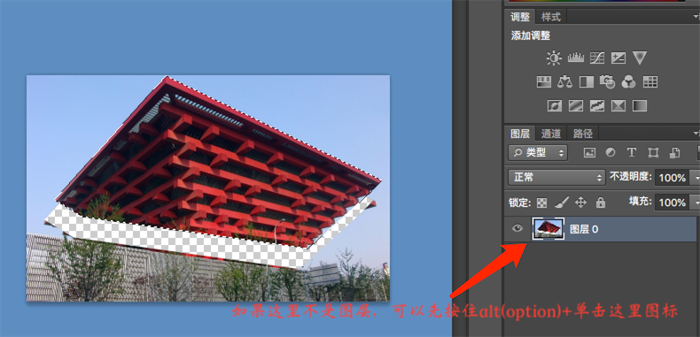

#### PS常用快捷键
* 载入选区：鼠标右键-载入选区
* 剪切选区内容:ctrl+j
* 后退：Ctrl+Z
* 连续撤销：Ctrl+Shift+Z
* 放大或缩小选区：ctrl+t ;   上下左右两边同时放大或者缩小：按Alt
* alt+shift+椭圆：水平中心处画正圆
* 空格键：在选区的时候，可以临时将鼠标变为抓手工具
* shift+选区：加选
* alt+选区：减选
* alt+shift+选区：相交选区
* 按Alt键用吸管工具吸取颜色可定义为当前背景色；
* 按用吸管工具吸取颜色可定义为前景色；
* 新建图层：ctrl+shift+n
* 取消选区：ctrl+d
* 移动的时候按住shift,水平移动

* 抠图时要注意：必须要在图层上面操作，否则...
 如果不是图层，可以先按住alt(option)+单击

##### 抠图

* 加选 shift+鼠标
* 减选 alt+鼠标
* 抠完用移动工具，将选区移动到新的图层文件，移动到ctrl+t缩小